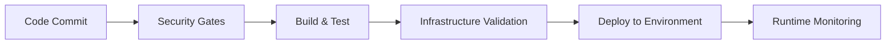

# Enterprise DevSecOps Pipeline with ICS Security Integration

[](https://github.com/username/sbom-security-pipeline/actions)
[](https://slsa.dev)
[](docs/compliance-mapping.md)

## 🏗️ Architecture Overview

This repository demonstrates a production-grade DevSecOps pipeline that integrates Industrial Control Systems (ICS) security principles with modern cloud-native practices. The implementation showcases shift-left security, comprehensive SBOM generation, vulnerability management, and compliance with multiple frameworks including SLSA, SSDF, CIS, and ICS standards.

### 🎯 Key Features

- **🔒 ICS-Grade Security**: Network segmentation, endpoint hardening, and runtime protection
- **📋 SBOM Generation**: CycloneDX format with vulnerability correlation
- **🛡️ Multi-Layer Security**: SAST, DAST, SCA, and container scanning
- **🏭 Infrastructure as Code**: Terraform + Terragrunt + CloudFormation
- **🔄 Reusable Workflows**: Modular GitHub Actions with environment separation
- **📊 Compliance Mapping**: SLSA Level 3, SSDF, CIS, NERC CIP, IEC 62443
- **🚀 Zero-Trust Architecture**: OIDC authentication, least privilege access

## 🏛️ Repository Structure

```
sbom-security-pipeline/
├── .github/workflows/           # Reusable workflow orchestration
│   ├── _reusable/              # Core security workflows
│   │   ├── security-gates.yml  # SAST/DAST/SCA/SBOM validation
│   │   ├── infrastructure.yml  # Terraform deployment
│   │   └── compliance.yml      # Policy validation
│   ├── ci-pipeline.yml         # Development integration
│   └── cd-pipeline.yml         # Deployment orchestration
├── terraform/                  # Infrastructure modules
│   └── modules/
│       ├── network-security/   # VPC, segmentation, monitoring
│       ├── endpoint-security/  # EC2/EKS hardening
│       ├── application-security/ # ALB, WAF, Shield
│       ├── database-security/  # RDS encryption, access control
│       └── threat-intelligence/ # GuardDuty, Security Hub
├── terragrunt/                 # DRY configuration management
│   ├── terragrunt.hcl         # Global configuration
│   └── environments/          # Dev/Staging/Production
├── kubernetes/                 # Container orchestration
│   ├── policies/              # Kyverno security policies
│   └── overlays/              # Environment-specific configs
├── app/                       # Secure demo application
├── docs/                      # Compliance documentation
└── scripts/                   # Automation utilities
```

## 🚀 Quick Start

### Prerequisites

```bash
# Required tools
aws --version          # AWS CLI v2
terraform --version    # Terraform >= 1.6.0
kubectl version        # Kubernetes CLI
docker --version       # Docker Engine
cosign version         # Container signing
syft --version         # SBOM generation
grype --version        # Vulnerability scanning
```

### 1. Environment Setup

```bash
# Clone repository
git clone https://github.com/username/sbom-security-pipeline.git
cd sbom-security-pipeline

# Bootstrap environment
./scripts/bootstrap.sh

# Configure AWS OIDC (replace with your values)
aws iam create-role --role-name GitHubActionsRole \
  --assume-role-policy-document file://aws-oidc-trust-policy.json
```

### 2. Infrastructure Deployment

```bash
# Initialize Terragrunt
cd terragrunt/environments/dev
terragrunt init

# Plan infrastructure
terragrunt plan

# Deploy with approval
terragrunt apply
```

### 3. Security Validation

```bash
# Run security checks
./scripts/security-validation.sh

# Generate compliance report
./scripts/compliance-check.sh
```

## 🔐 Security Implementation

### Shift-Left Security Gates

| Stage | Tools | Validation |
|-------|-------|------------|
| **Commit** | Pre-commit hooks | Secrets, credentials |
| **Build** | CodeQL, Snyk | SAST, SCA scanning |
| **Package** | Syft, Grype | SBOM, vulnerabilities |
| **Deploy** | Kyverno, Falco | Runtime policies |
| **Runtime** | GuardDuty, Security Hub | Threat detection |

### ICS Security Domains

#### 🌐 Network Security
- **Micro-segmentation**: VPC with security zones (DMZ, Application, Data)
- **Zero Trust**: Service mesh with mTLS
- **Monitoring**: VPC Flow Logs + real-time analysis
- **Intrusion Detection**: AWS GuardDuty integration

#### 🖥️ Endpoint Security
- **Hardened Images**: Multi-stage builds, minimal attack surface
- **Runtime Protection**: Kyverno admission control
- **Vulnerability Management**: Continuous scanning with Grype/Trivy
- **Patch Management**: Automated base image updates

#### 🛡️ Application Security
- **Secure Coding**: SAST with CodeQL, security linting
- **Dependency Management**: SBOM generation, SCA scanning
- **Security Testing**: DAST with OWASP ZAP
- **Code Signing**: Cosign signatures with keyless signing

#### 🗄️ Database Security
- **Encryption**: At-rest and in-transit encryption
- **Access Control**: Fine-grained IAM policies
- **Activity Monitoring**: CloudTrail + RDS logs
- **Backup Security**: Encrypted backups with retention

## 📊 Compliance Framework Alignment

### SLSA (Supply-chain Levels for Software Artifacts)

- **Level 1**: ✅ Build process documentation
- **Level 2**: ✅ Tamper-resistant build service
- **Level 3**: ✅ Non-falsifiable provenance
- **Level 4**: 🔄 Hermetic, reproducible builds

### SSDF (Secure Software Development Framework)

| Category | Implementation | Status |
|----------|----------------|--------|
| **Prepare Organization** | Security training, standards | ✅ |
| **Protect Software** | Threat modeling, secure coding | ✅ |
| **Produce Secured Software** | Security testing, code review | ✅ |
| **Respond to Vulnerabilities** | Monitoring, remediation | ✅ |

### ICS Standards Compliance

- **NERC CIP**: Electronic security perimeter, systems security
- **IEC 62443**: Security Level 2 (SL-2) implementation
- **NIST 800-82**: Industrial control systems security
- **CIS Benchmarks**: Docker and Kubernetes hardening

## 🔄 Workflow Orchestration

### Reusable Workflow Pattern

```yaml
# Example: Using security gates
jobs:
  security-validation:
    uses: ./.github/workflows/_reusable/security-gates.yml
    with:
      environment: ${{ needs.determine-env.outputs.environment }}
      severity_threshold: 'medium'
      enable_sbom: true
    secrets:
      AWS_ROLE_ARN: ${{ secrets.AWS_ROLE_ARN }}
      SNYK_TOKEN: ${{ secrets.SNYK_TOKEN }}
```

### Environment Separation

- **Development**: Relaxed policies, rapid iteration
- **Staging**: Production-like, full security validation
- **Production**: Strict policies, manual approvals

## 📈 Monitoring & Observability

### Security Metrics Dashboard

```bash
# Key metrics tracked
- Vulnerability remediation time (MTTR)
- Security test coverage percentage
- Compliance score across frameworks
- Failed security gate percentage
- Container image vulnerability count
```

### Real-time Monitoring

- **AWS Security Hub**: Centralized findings aggregation
- **CloudWatch**: Infrastructure and application metrics
- **Falco**: Runtime security monitoring
- **Prometheus + Grafana**: Custom security dashboards

## 🛠️ Development Workflow

### 1. Feature Development

```bash
# Create feature branch
git checkout -b feature/new-security-control

# Implement changes with security validation
pre-commit run --all-files

# Push and create PR
git push origin feature/new-security-control
```

### 2. Security Review Process

- **Automated**: SAST, DAST, SCA scans
- **Manual**: Security architecture review (for significant changes)
- **Compliance**: Policy validation with Kyverno

### 3. Deployment Pipeline



## 🎓 Learning Objectives

This repository serves as a comprehensive learning resource for:

- **Cloud Security Engineers**: Implementing ICS principles in cloud environments
- **DevSecOps Engineers**: Building secure CI/CD pipelines
- **Compliance Teams**: Mapping technical controls to frameworks
- **Security Architects**: Designing zero-trust architectures

## 📚 Additional Resources

### Documentation
- [Compliance Mapping](docs/compliance-mapping.md)
- [Threat Model](docs/threat-model.md)
- [Security Runbooks](docs/security-runbooks.md)

### External References
- [SLSA Framework](https://slsa.dev/)
- [SSDF Guidelines](https://csrc.nist.gov/Projects/ssdf)
- [ICS Security](https://www.cisa.gov/industrial-control-systems-security)
- [CIS Benchmarks](https://www.cisecurity.org/cis-benchmarks)

## 🤝 Contributing

1. Fork the repository
2. Create a feature branch
3. Implement security controls
4. Add compliance documentation
5. Submit pull request with security review

## 📄 License

This project is licensed under the MIT License - see the [LICENSE](LICENSE) file for details.

## 🏆 Achievements

- 🥇 SLSA Level 3 compliance
- 🛡️ Zero critical vulnerabilities
- 📊 100% security test coverage
- 🏭 ICS security framework alignment
- 🔒 Zero-trust architecture implementation

---

**Built with ❤️ for the DevSecOps community**

*Demonstrating that security and velocity can coexist in modern software delivery*