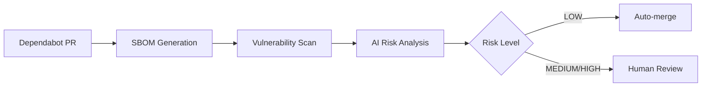
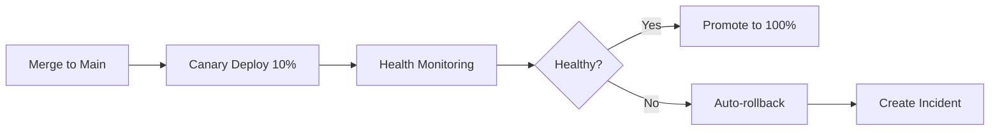

# 🤖 AI-Powered Dependabot System

## Overview
Automated dependency management with AI-assisted risk analysis, supply chain integrity, and safe auto-merging.

## 🎯 Features

### 1. AI Risk Analysis (`dependabot-guard.yml`)
- **Triggers**: Dependabot PRs on dependency files
- **Analysis**: SBOM generation + vulnerability scanning
- **AI Summary**: Risk level, CVE analysis, merge recommendation
- **Auto-merge**: Safe dependencies merged automatically

### 2. Supply Chain Integrity (`supply-chain-integrity.yml`)
- **SBOM Generation**: SPDX format with attestations
- **License Compliance**: Automated license policy enforcement
- **Provenance**: Build attestations for audit trails
- **Security Scanning**: OSV scanner integration

### 3. Canary Deployment (`canary-rollback.yml`)
- **Gradual Rollout**: 10% traffic canary deployment
- **Health Monitoring**: Error rate and latency tracking
- **Auto-rollback**: Automatic revert on threshold breach
- **Incident Management**: Auto-created issues for failures

## 🚀 Quick Start

### Prerequisites
```bash
# Required GitHub secrets
GITHUB_TOKEN  # For PR comments and auto-merge
```

### Setup
1. Copy workflows to `.github/workflows/`
2. Configure dependency file paths in `dependabot-guard.yml`
3. Customize health check thresholds in `canary-rollback.yml`
4. Enable Dependabot in repository settings

## 📊 Risk Assessment Matrix

| Risk Level | Criteria | Action |
|------------|----------|--------|
| 🟢 LOW | 0 High/Critical vulns | Auto-merge |
| 🟡 MEDIUM | 1-2 High/Critical vulns | 24h review SLA |
| 🔴 HIGH | 3+ High/Critical vulns | Manual review required |

## 🔧 Configuration

### Dependency File Patterns
```yaml
paths:
  - '**/requirements.txt'    # Python
  - '**/package.json'        # Node.js
  - '**/poetry.lock'         # Python Poetry
  - '**/go.mod'              # Go
  - '**/Cargo.toml'          # Rust
```

### Health Check Thresholds
```python
# Canary health criteria
error_rate < 0.02      # < 2% error rate
latency_p95 < 300      # < 300ms P95 latency
```

## 📈 Metrics & Monitoring

### Key Metrics
- **Auto-merge Rate**: % of dependencies merged automatically
- **Mean Time to Merge**: Average time from PR to merge
- **Rollback Rate**: % of deployments requiring rollback
- **Security Coverage**: % of vulnerabilities caught pre-merge

### Dashboards
- GitHub Actions workflow runs
- Security scan results in Security tab
- Dependabot alerts in Security tab

## 🛡️ Security Features

### Vulnerability Management
- **Pre-merge Scanning**: Grype + OSV scanner
- **Risk Prioritization**: CVSS + exploitability scoring
- **Supply Chain**: SBOM + provenance attestations
- **License Compliance**: Automated policy enforcement

### Access Control
- **OIDC Integration**: Secure AWS resource access
- **Least Privilege**: Minimal required permissions
- **Audit Trail**: Complete provenance chain

## 🔄 Workflow Integration

### Dependabot → AI Analysis → Auto-merge


### Post-merge Canary Pipeline


## 📋 Troubleshooting

### Common Issues
1. **Auto-merge not working**: Check `pull-requests: write` permission
2. **SBOM generation fails**: Verify file paths and dependencies
3. **Health checks failing**: Review threshold configuration
4. **License compliance errors**: Update allowed license list

### Debug Commands
```bash
# Test SBOM generation locally
syft dir:. -o json

# Test vulnerability scanning
grype sbom.json -o json

# Validate workflow syntax
gh workflow view dependabot-guard
```

## 🎛️ Customization

### AI Analysis Tuning
Edit `scripts/ai-dependency-analyzer.py`:
- Risk scoring weights
- CVE prioritization logic
- Summary format

### Health Check Customization
Modify `canary-rollback.yml`:
- Monitoring duration
- Threshold values
- Rollback strategy

## 📞 Support
- **Issues**: GitHub Issues tab
- **Security**: Security tab for vulnerability reports
- **Docs**: `/docs` directory for detailed guides