# 🚀 Future Pipeline Architecture - N8N AI Agents & Ansible EDA Integration

> **Advanced automation framework combining N8N AI agents with Event-Driven Ansible for sophisticated DevSecOps orchestration beyond traditional CI/CD.**

## 🎯 Vision Statement

Evolution from traditional CI/CD to **Event-Driven Intelligent Automation** where AI agents orchestrate complex workflows, respond to security events in real-time, and provide autonomous remediation capabilities using Ansible automation.

## 🏗️ Future Architecture Overview

```mermaid
graph TB
    subgraph "🧠 N8N AI Agent Layer"
        A[Security AI Agent] --> B[Compliance AI Agent]
        B --> C[Infrastructure AI Agent]
        C --> D[Deployment AI Agent]
        D --> E[Monitoring AI Agent]
    end
    
    subgraph "⚡ Event-Driven Layer"
        F[GitHub Events] --> G[Ansible EDA]
        H[Security Alerts] --> G
        I[Infrastructure Events] --> G
        J[Compliance Triggers] --> G
    end
    
    subgraph "🎭 Automation Execution Layer"
        G --> K[Ansible Playbooks]
        K --> L[Terraform Execution]
        K --> M[Security Remediation]
        K --> N[Compliance Reporting]
    end
    
    A --> F
    E --> H
    
    style A fill:#e1f5fe
    style G fill:#f3e5f5
    style K fill:#e8f5e8
```



## 🤖 N8N AI Agent Architecture

### **1. Security AI Agent**

**Purpose**: Autonomous security monitoring, threat detection, and response orchestration

**Capabilities**:
- **Real-time Threat Analysis**: Process security alerts from multiple sources
- **Vulnerability Prioritization**: AI-driven risk assessment and remediation planning
- **Automated Incident Response**: Orchestrate containment and remediation workflows
- **Security Compliance Monitoring**: Continuous compliance validation and reporting

**Implementation Framework**:
```json
{
  "agent_name": "security-ai-agent",
  "triggers": [
    "security_alert_webhook",
    "vulnerability_scan_complete",
    "compliance_check_failed",
    "incident_reported"
  ],
  "ai_models": {
    "threat_analysis": "gpt-4-turbo",
    "risk_assessment": "claude-3-opus",
    "remediation_planning": "custom-trained-model"
  },
  "integrations": [
    "aws_security_hub",
    "snyk",
    "kics",
    "trivy",
    "ansible_eda"
  ]
}
```

**Workflow Example**:
```yaml
# N8N Workflow: Automated Security Response
name: "Security Incident Response"
trigger: "security_alert_webhook"
steps:
  1. analyze_threat_with_ai:
      model: "gpt-4-security"
      prompt: "Analyze this security alert and determine severity and recommended actions"
  
  2. check_compliance_impact:
      evaluate: "SLSA, SSDF, CIS compliance implications"
  
  3. trigger_ansible_eda:
      webhook: "https://eda.internal/security-response"
      payload: "${ai_analysis_result}"
  
  4. notify_security_team:
      channels: ["slack", "pagerduty", "email"]
      priority: "${calculated_severity}"
```

### **2. Compliance AI Agent**

**Purpose**: Intelligent compliance monitoring, gap analysis, and automated evidence collection

**Advanced Features**:
- **Dynamic Policy Interpretation**: AI-powered analysis of compliance requirements
- **Automated Evidence Collection**: Intelligent gathering of compliance artifacts
- **Gap Analysis & Recommendations**: Proactive compliance improvement suggestions
- **Audit Preparation**: Automated audit trail generation and reporting

**Implementation**:
```yaml
# N8N Compliance Agent Workflow
name: "Compliance Continuous Monitoring"
schedule: "0 */4 * * *"  # Every 4 hours
steps:
  1. scan_infrastructure:
      tools: ["kics", "checkov", "terrascan"]
      frameworks: ["SLSA", "SSDF", "CIS", "SOC2"]
  
  2. ai_compliance_analysis:
      model: "claude-3-compliance"
      task: "Analyze scan results against compliance frameworks"
  
  3. generate_evidence:
      collect:
        - security_configurations
        - access_control_logs
        - vulnerability_remediation_records
        - change_management_approvals
  
  4. trigger_remediation:
      condition: "compliance_gap_detected"
      action: "trigger_ansible_remediation_playbook"
```

### **3. Infrastructure AI Agent**

**Purpose**: Intelligent infrastructure management, optimization, and predictive maintenance

**Key Capabilities**:
- **Predictive Scaling**: AI-driven resource optimization
- **Cost Optimization**: Intelligent resource allocation and rightsizing
- **Drift Detection**: Automated infrastructure state management
- **Performance Optimization**: AI-powered performance tuning

### **4. Deployment AI Agent**

**Purpose**: Autonomous deployment orchestration with intelligent rollback and canary management

**Advanced Features**:
- **Intelligent Deployment Strategies**: AI-selected deployment patterns
- **Predictive Rollback**: Preemptive failure detection and mitigation
- **Canary Analysis**: AI-powered canary deployment success evaluation
- **Cross-Environment Orchestration**: Intelligent promotion workflows

## ⚡ Event-Driven Ansible (EDA) Integration

### **EDA Architecture**

Event-Driven Ansible provides the critical bridge between N8N's orchestration capabilities and Ansible's configuration management through YAML rulebooks that connect event sources to conditional rules triggering playbook execution.

**Core Components**:
1. **Event Sources**: Webhooks, Kafka, Alertmanager, CloudWatch Events
2. **Rulebooks**: YAML-defined conditional logic for event processing
3. **Actions**: Ansible playbook execution based on rule matches
4. **State Management**: Persistent event state and decision tracking

### **EDA Rulebook Examples**

#### **Security Event Response**
```yaml
# rulebooks/security-response.yml
---
- name: "Security Incident Response"
  hosts: localhost
  sources:
    - ansible.eda.webhook:
        host: 0.0.0.0
        port: 5000
        endpoint: /security-alert
  
  rules:
    - name: "Critical Security Alert"
      condition: event.payload.severity == "critical"
      actions:
        - run_playbook:
            name: playbooks/security-incident-response.yml
            extra_vars:
              alert_id: "{{ event.payload.alert_id }}"
              severity: "{{ event.payload.severity }}"
              affected_systems: "{{ event.payload.systems }}"
    
    - name: "Vulnerability Detected"
      condition: event.payload.type == "vulnerability" and event.payload.cvss_score > 7.0
      actions:
        - run_playbook:
            name: playbooks/vulnerability-remediation.yml
            extra_vars:
              cve_id: "{{ event.payload.cve_id }}"
              affected_packages: "{{ event.payload.packages }}"
```

#### **Infrastructure Event Response**
```yaml
# rulebooks/infrastructure-events.yml
---
- name: "Infrastructure Event Processing"
  hosts: localhost
  sources:
    - ansible.eda.aws_cloudwatch_events:
        region: us-east-1
        event_patterns:
          - source: ["aws.autoscaling"]
          - source: ["aws.ec2"]
          - source: ["aws.ecs"]
  
  rules:
    - name: "Auto Scaling Event"
      condition: event.source == "aws.autoscaling" and event.detail.ActivityType == "Terminate"
      actions:
        - run_playbook:
            name: playbooks/instance-replacement.yml
            
    - name: "Security Group Change"
      condition: event.source == "aws.ec2" and "AuthorizeSecurityGroupIngress" in event.eventName
      actions:
        - run_playbook:
            name: playbooks/security-group-audit.yml
```

#### **Compliance Event Response**
```yaml
# rulebooks/compliance-monitoring.yml
---
- name: "Compliance Event Monitoring"
  hosts: localhost
  sources:
    - ansible.eda.webhook:
        host: 0.0.0.0
        port: 5001
        endpoint: /compliance-event
  
  rules:
    - name: "Compliance Violation Detected"
      condition: event.payload.compliance_status == "failed"
      actions:
        - run_playbook:
            name: playbooks/compliance-remediation.yml
            extra_vars:
              framework: "{{ event.payload.framework }}"
              control_id: "{{ event.payload.control_id }}"
              remediation_priority: "{{ event.payload.priority }}"
```

### **Ansible Playbook Integration**

#### **Security Incident Response Playbook**
```yaml
# playbooks/security-incident-response.yml
---
- name: "Automated Security Incident Response"
  hosts: all
  gather_facts: yes
  vars:
    incident_id: "{{ alert_id }}"
    severity_level: "{{ severity }}"
  
  tasks:
    - name: "Create incident ticket"
      uri:
        url: "https://api.servicenow.com/incident"
        method: POST
        body_format: json
        body:
          short_description: "Security Alert {{ incident_id }}"
          severity: "{{ severity_level }}"
          category: "Security"
    
    - name: "Isolate affected systems"
      when: severity_level == "critical"
      block:
        - name: "Update security groups"
          amazon.aws.ec2_group:
            name: "emergency-isolation"
            description: "Emergency isolation group"
            rules:
              - proto: tcp
                ports:
                  - 22
                cidr_ip: "10.0.0.0/8"
                rule_desc: "SSH from internal only"
    
    - name: "Collect forensic data"
      shell: |
        # Collect system logs, network connections, running processes
        tar -czf /tmp/forensic-{{ incident_id }}.tar.gz \
          /var/log/auth.log \
          /var/log/syslog \
          /proc/net/tcp \
          /proc/*/cmdline
    
    - name: "Update security dashboard"
      uri:
        url: "https://security-dashboard.internal/api/incidents"
        method: PUT
        body_format: json
        body:
          incident_id: "{{ incident_id }}"
          status: "contained"
          timestamp: "{{ ansible_date_time.iso8601 }}"
```

## 🔄 Advanced Use Cases

### **Use Case 1: Autonomous Security Response**

**Scenario**: Critical vulnerability discovered in production container

**Workflow**:
1. **Detection**: Trivy scan identifies CVE-2024-XXXX in production container
2. **N8N Security Agent**: Analyzes vulnerability context and business impact
3. **EDA Trigger**: Webhook sent to Ansible EDA with vulnerability details
4. **Ansible Response**: 
   - Creates security incident ticket
   - Deploys patched container to staging
   - Runs automated security tests
   - If tests pass, triggers blue-green deployment
   - Monitors application health post-deployment
5. **Compliance Update**: Updates vulnerability management documentation

### **Use Case 2: Intelligent Compliance Monitoring**

**Scenario**: New SLSA requirement impacts deployment pipeline

**Workflow**:
1. **Policy Update**: New SLSA requirement published
2. **N8N Compliance Agent**: Analyzes current pipeline against new requirement
3. **Gap Analysis**: Identifies missing provenance attestation
4. **EDA Automation**: Triggers Ansible playbook to:
   - Update GitHub Actions workflows
   - Configure cosign attestation
   - Update security policies
   - Run compliance validation tests
5. **Evidence Collection**: Automatically generates compliance artifacts

### **Use Case 3: Predictive Infrastructure Management**

**Scenario**: Predicted resource exhaustion based on usage patterns

**Workflow**:
1. **Monitoring**: N8N Infrastructure Agent analyzes CloudWatch metrics
2. **Prediction**: AI model predicts resource exhaustion in 2 hours
3. **Proactive Response**: EDA triggers Ansible playbooks to:
   - Scale up application instances
   - Provision additional storage
   - Update load balancer configuration
   - Send proactive notifications to team
4. **Validation**: Monitors metrics to confirm successful scaling

## 🛠️ Implementation Roadmap

### **Phase 1: Foundation (Months 1-2)**
- Deploy N8N AI agent platform
- Configure Ansible EDA with basic rulebooks
- Implement webhook integrations
- Create security response playbooks

### **Phase 2: Intelligence (Months 3-4)**
- Integrate AI models for threat analysis
- Implement predictive analytics
- Advanced event correlation
- Automated evidence collection

### **Phase 3: Optimization (Months 5-6)**
- Machine learning model training
- Cross-environment orchestration
- Advanced compliance automation
- Performance optimization

### **Phase 4: Scale (Months 7-8)**
- Multi-cloud support
- Advanced AI agents
- Enterprise integration
- Full autonomous operations

## 🏗️ Technical Architecture

### **N8N AI Agent Deployment**
```yaml
# docker-compose.n8n-agents.yml
version: '3.8'
services:
  n8n-security-agent:
    image: n8nio/n8n:latest
    environment:
      - N8N_AI_ENABLED=true
      - N8N_AI_PROVIDER=openai
      - N8N_WEBHOOK_URL=https://n8n.internal
      - SECURITY_INTEGRATIONS=aws_security_hub,snyk,kics
    volumes:
      - n8n_security_data:/home/node/.n8n
    
  ansible-eda:
    image: quay.io/ansible/ansible-eda:latest
    environment:
      - EDA_RULEBOOK_DIR=/opt/eda/rulebooks
      - EDA_INVENTORY=/opt/eda/inventory
    volumes:
      - ./eda/rulebooks:/opt/eda/rulebooks
      - ./eda/playbooks:/opt/eda/playbooks
    ports:
      - "5000:5000"  # Security webhooks
      - "5001:5001"  # Compliance webhooks
```

### **Integration Points**


## 🎯 Success Metrics

### **Automation Efficiency**
- **Incident Response Time**: From hours to minutes
- **Compliance Gap Resolution**: Automated 80% of remediation tasks
- **Deployment Success Rate**: 99.9% with intelligent rollback
- **Security Alert Processing**: 100% automated triage

### **Intelligence Metrics**
- **Threat Prediction Accuracy**: 95% early warning system
- **Compliance Drift Prevention**: 90% proactive remediation
- **Infrastructure Optimization**: 30% cost reduction through AI
- **False Positive Reduction**: 80% improvement in alert quality

## 🚀 Next-Generation Capabilities

### **Advanced AI Integration**
- **Multi-Modal AI**: Vision, text, and code analysis
- **Federated Learning**: Cross-organization threat intelligence
- **Explainable AI**: Transparent decision-making processes
- **Continuous Learning**: Self-improving security responses

### **Edge Computing Integration**
- **IoT Security Management**: Device-level security orchestration
- **Edge AI Processing**: Distributed intelligence deployment
- **Offline Capability**: Autonomous operation during connectivity loss

### **Quantum-Ready Security**
- **Post-Quantum Cryptography**: Future-proof security implementation
- **Quantum Key Distribution**: Advanced secure communication
- **Quantum-Safe Algorithms**: Migration planning and implementation

---

> **🎓 Learning Path**: This advanced architecture represents the evolution of DevSecOps into **Autonomous SecOps** where AI agents handle routine security operations, compliance monitoring, and infrastructure management, allowing human experts to focus on strategic security initiatives and advanced threat research.

**Ready for the future of intelligent automation!** 🚀🤖