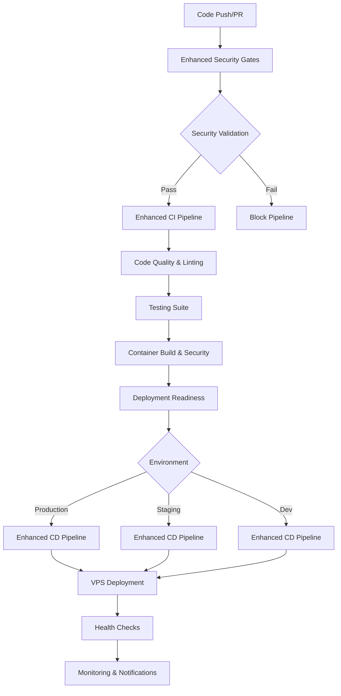
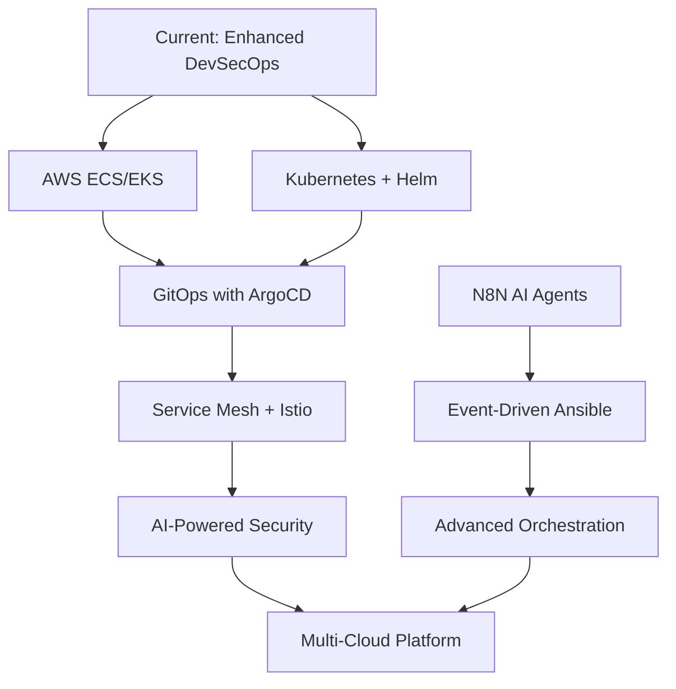

# 🔄 Enhanced DevSecOps Workflow Guide

> **Comprehensive guide to the enhanced multi-layer security CI/CD pipelines with KICS integration and advanced orchestration capabilities.**

## 🗺️ Table of Contents

- [Overview](#overview)
- [Workflow Architecture](#workflow-architecture)
- [Security-First Approach](#security-first-approach)
- [Pipeline Configuration](#pipeline-configuration)
- [Security Tools Integration](#security-tools-integration)
- [Deployment Strategies](#deployment-strategies)
- [Environment Management](#environment-management)
- [Orchestration Guide](#orchestration-guide)
- [Best Practices](#best-practices)
- [Troubleshooting](#troubleshooting)
- [Future Enhancements](#future-enhancements)

## Overview

This repository implements a **security-first DevSecOps approach** with comprehensive multi-layer scanning, automated deployment capabilities, and advanced workflow orchestration. The system is designed following **shift-left security principles** where security validation happens at the earliest possible stage of the development lifecycle.

### 🎯 Key Features

✅ **Multi-layer Security Scanning**: KICS, Checkov, Terrascan, Trivy, TruffleHog, Syft/Grype  
✅ **Shift-Left Security**: Security gates as the first job in every pipeline  
✅ **Environment-Aware**: Dynamic configuration based on target environment  
✅ **Configurable Severity Gates**: Customizable security thresholds per environment  
✅ **VPS Deployment**: Production-ready deployment to Hostinger VPS  
✅ **Container Security**: Image scanning, signing with Cosign, SBOM generation  
✅ **Workflow Orchestration**: Centralized management of complex deployment scenarios  
✅ **Cross-Repository Sync**: Workflow synchronization across multiple repositories  
✅ **Compliance Ready**: SLSA, SSDF, and CIS compliance validation  

## Workflow Architecture

### 🗺️ Pipeline Flow



### 🗜️ Workflow Components

| Workflow | Purpose | Trigger | Duration |
|----------|---------|---------|----------|
| **Enhanced Security Gates** | Multi-layer security scanning | First job in CI | 5-10 min |
| **Enhanced CI Pipeline** | Build, test, containerize | Push/PR | 10-15 min |
| **Enhanced CD Pipeline** | Deploy to environments | CI completion | 5-10 min |
| **Workflow Orchestrator** | Advanced workflow management | Manual/API | Variable |

## Security-First Approach

### 🛡️ Security Gate Architecture

Security validation occurs **before any other processing** to implement true shift-left security:

```yaml
jobs:
  # ALWAYS FIRST - Security Gates
  security-gates:
    name: 🛡️ Security Gates - Shift Left Security
    uses: ./.github/workflows/enhanced-security-gates.yml
    # ... configuration
  
  # Only runs if security passes
  code-quality:
    needs: security-gates
    # ... rest of pipeline
```

### 🔧 Security Tools Matrix

| Tool | Category | Focus Area | Severity Levels |
|------|----------|------------|----------------|
| **KICS** | IaC Security | Comprehensive rule coverage, 25+ technologies | Info, Low, Medium, High |
| **Checkov** | IaC Security | Policy-as-code, cloud provider support | Low, Medium, High, Critical |
| **Terrascan** | IaC Security | Compliance frameworks, enterprise | Low, Medium, High, Critical |
| **Trivy** | Container Security | OS packages, container images | Unknown, Low, Medium, High, Critical |
| **TruffleHog** | Secrets Detection | API keys, passwords, tokens | N/A (Boolean: found/not found) |
| **Syft/Grype** | SBOM/Vulnerabilities | Software bill of materials | Low, Medium, High, Critical |

### 📊 Security Tool Comparison

#### Infrastructure as Code (IaC) Scanners

- **KICS**: 🎯 Best for comprehensive rule coverage and broad technology support
- **Checkov**: 🎯 Excellent for policy-as-code and strong cloud provider integration
- **Terrascan**: 🎯 Focus on compliance frameworks, ideal for enterprise environments

#### Recommended Usage Strategy

1. **Development Environment**: Use KICS for broad coverage and fast feedback
2. **Staging Environment**: Add Checkov for policy validation
3. **Production Environment**: Use all three scanners for maximum security assurance

## Pipeline Configuration

### 🌍 Environment Variables (DRY Principle)

All workflows use centralized environment variables to eliminate hardcoding:

```yaml
env:
  # Tool versions - centrally managed
  KICS_VERSION: "1.7.13"
  CHECKOV_VERSION: "3.1.34"
  TERRASCAN_VERSION: "1.18.11"
  TRIVY_VERSION: "0.48.3"
  
  # Security configuration
  SEVERITY_THRESHOLD: ${{ inputs.severity_threshold || 'medium' }}
  FAIL_ON_FINDINGS: ${{ inputs.fail_on_severity || 'false' }}
  
  # Dynamic environment detection
  ENVIRONMENT: ${{ 
    github.ref == 'refs/heads/main' && 'production' ||
    github.ref == 'refs/heads/S-lab' && 'staging' ||
    'dev' 
  }}
```

### ⚙️ Configuration Options

#### Security Configuration

```yaml
# Security severity thresholds
severity_threshold: 'medium'  # info|low|medium|high|critical

# Security tools to run
scan_tools: 'kics,checkov,terrascan,trivy'  # comma-separated

# Fail behavior
fail_on_severity: false  # Default: false for development-friendly gates
```

#### Environment-Specific Behavior

| Environment | Security Threshold | Fail on Findings | Container Signing |
|-------------|-------------------|------------------|------------------|
| **Development** | medium | false | disabled |
| **Staging** | medium | false | enabled |
| **Production** | high | true | enabled |

### 🔄 Concurrency Control

Workflows implement intelligent concurrency control:

```yaml
concurrency:
  group: security-gates-${{ inputs.environment }}-${{ github.ref }}
  cancel-in-progress: false  # Maintain audit trail
```

## Security Tools Integration

### 🛡️ KICS Integration (New)

**KICS (Keeping Infrastructure as Code Secure)** is now integrated as a primary security scanner:

```bash
# KICS installation and execution
curl -sfL "https://github.com/Checkmarx/kics/releases/download/v1.7.13/kics_1.7.13_linux_x64.tar.gz" | tar -xzC /tmp
sudo mv /tmp/kics /usr/local/bin/

# Comprehensive scanning
kics scan \
  --path . \
  --output-path security-reports/kics \
  --report-formats json,sarif,html \
  --severity medium \
  --verbose
```

#### KICS Advantages:
- **Broad Technology Support**: 25+ IaC technologies
- **Comprehensive Rules**: 1000+ security queries
- **Multiple Output Formats**: JSON, SARIF, HTML
- **Severity Classification**: Info, Low, Medium, High

### 🔧 Tool Integration Matrix

```yaml
# Matrix strategy for parallel scanning
strategy:
  matrix:
    scanner: 
      - name: 'kics'
        enabled: ${{ contains(env.SCAN_TOOLS, 'kics') }}
      - name: 'checkov' 
        enabled: ${{ contains(env.SCAN_TOOLS, 'checkov') }}
      - name: 'terrascan'
        enabled: ${{ contains(env.SCAN_TOOLS, 'terrascan') }}
  fail-fast: false  # Continue with other scanners
```

### 📊 SBOM Generation

Software Bill of Materials (SBOM) generation using Syft:

```bash
# Application SBOM (CycloneDX format)
syft packages dir:./app -o cyclonedx-json=application-sbom.json

# Infrastructure SBOM 
syft packages dir:. -o cyclonedx-json=infrastructure-sbom.json

# Vulnerability assessment with Grype
grype sbom:application-sbom.json -o sarif --file vulnerabilities.sarif
```

## Deployment Strategies

### 🖥️ VPS Deployment (Hostinger)

Production deployment to Hostinger VPS with the following configuration:

```yaml
VPS Configuration:
- Host: 148.230.94.85
- User: root
- Port: 22
- Container Platform: Docker + Docker Compose
- Monitoring: Watchtower for auto-updates
- Security: UFW firewall configuration
```

#### Deployment Process

1. **SSH Connection Setup**: Secure key-based authentication
2. **Environment Preparation**: Docker installation and configuration
3. **Container Registry Login**: GitHub Container Registry authentication
4. **Application Deployment**: Docker Compose orchestration
5. **Health Validation**: Comprehensive health checks and smoke tests
6. **Monitoring Setup**: Watchtower for automatic updates

### 🔗 Container Registry

GitHub Container Registry (ghcr.io) integration:

```yaml
Container Configuration:
- Registry: ghcr.io
- Image Naming: ${{ github.repository }}:${{ environment }}-${{ sha }}
- Multi-architecture: linux/amd64 (expandable)
- Signing: Cosign keyless signing for staging/production
- SBOM: Attached to container images
```

## Environment Management

### 🌍 Environment Detection

Automatic environment detection based on branch patterns:

```yaml
# Dynamic environment mapping
ENVIRONMENT: ${{ 
  github.ref == 'refs/heads/main' && 'production' ||
  github.ref == 'refs/heads/S-lab' && 'staging' ||
  'dev' 
}}
```

### 🗜️ Environment-Specific Configuration

| Setting | Development | Staging | Production |
|---------|-------------|---------|------------|
| Security Threshold | medium | medium | high |
| Fail on Security Issues | false | false | true |
| Container Signing | disabled | enabled | enabled |
| Multi-Architecture Build | false | false | true |
| Health Check Retries | 5 | 10 | 10 |
| Deployment Approval | none | none | manual (future) |

### 🔐 Branch Protection Strategy

```yaml
Branch Strategy:
- main: Production deployments only
- S-lab: Staging deployments and testing
- develop: Development and feature integration
- feature/*: Development with PR to S-lab
```

## Orchestration Guide

### 🎼 Workflow Orchestrator

The centralized orchestrator manages complex deployment scenarios:

#### 🗺️ Orchestration Modes

1. **security-only**: Run comprehensive security validation only
2. **ci-only**: Execute CI pipeline with security gates
3. **cd-only**: Run deployment pipeline with security validation
4. **full-pipeline**: Complete CI/CD pipeline execution
5. **cross-repo-sync**: Synchronize workflows across repositories
6. **emergency-deploy**: Fast deployment with minimal checks (use with caution)
7. **rollback**: Rollback to previous deployment state
8. **disaster-recovery**: Full disaster recovery procedures

#### 🔧 Security Levels

- **minimal**: Basic security checks (not recommended for production)
- **standard**: Standard security validation with medium severity threshold
- **enhanced**: Full security suite with all tools and high severity threshold  
- **compliance**: Compliance-focused validation (SLSA, SSDF, CIS)

### 📡 Manual Orchestration

Access the orchestrator via GitHub Actions UI:

1. Navigate to **Actions** tab
2. Select **Workflow Orchestrator**
3. Click **Run workflow**
4. Configure parameters:
   - Orchestration Mode
   - Target Environment  
   - Security Level
   - Deployment Strategy
   - Advanced Options

## Best Practices

### ✅ Security Best Practices

1. **Always Run Security Gates First**: Never bypass security validation
2. **Environment-Appropriate Thresholds**: Stricter security for production
3. **Regular Tool Updates**: Keep security tools updated via centralized versioning
4. **SBOM Generation**: Always generate and store SBOMs for compliance
5. **Container Signing**: Sign all containers for staging and production
6. **Secrets Management**: Use GitHub Secrets, never hardcode credentials
7. **Regular Security Reviews**: Periodically review and update security policies

### 🚀 Development Workflow Best Practices

1. **Feature Branch Strategy**: Create feature branches from S-lab
2. **Early Security Feedback**: Run security scans locally before pushing
3. **Small, Frequent Commits**: Easier to identify and fix security issues
4. **PR Reviews**: Always require pull request reviews for main/S-lab
5. **Automated Testing**: Comprehensive test coverage for reliable deployments
6. **Documentation**: Keep workflow documentation updated

### 🗜️ Configuration Management

1. **DRY Principle**: Centralize environment variables and configuration
2. **Version Pinning**: Pin tool versions for reproducible builds
3. **Environment Parity**: Keep dev/staging/production as similar as possible
4. **Graceful Degradation**: Handle missing tools/secrets gracefully
5. **Audit Trail**: Maintain comprehensive logging and artifact retention

## Troubleshooting

### 🔍 Common Issues

#### Security Gate Failures

**Symptom**: Security gates job fails with findings  
**Solution**: 
1. Review security reports in job artifacts
2. Check severity threshold configuration
3. Consider adjusting `fail_on_severity` for development
4. Fix security issues in code/infrastructure

**Example**:
```yaml
# Temporary workaround for development
fail_on_severity: false  # Allow findings but report them
```

#### Container Build Failures

**Symptom**: Docker build fails in CI pipeline  
**Solution**:
1. Check Dockerfile syntax and dependencies
2. Verify base image availability
3. Review build logs for specific errors
4. Test build locally before pushing

#### VPS Deployment Issues

**Symptom**: Deployment to VPS fails  
**Common Causes**:
- SSH key configuration
- VPS connectivity issues
- Container registry authentication
- Resource constraints on VPS

**Solution**:
```bash
# Test SSH connection manually
ssh -p 22 root@148.230.94.85 "echo 'Connection test'"

# Check VPS resources
ssh root@148.230.94.85 "df -h && free -m"

# Verify Docker status
ssh root@148.230.94.85 "docker --version && docker ps"
```

### 📊 Debugging Workflows

#### Enable Debug Logging

```yaml
# Add to workflow for verbose output
env:
  ACTIONS_STEP_DEBUG: true
  ACTIONS_RUNNER_DEBUG: true
```

#### Artifact Collection

All workflows generate artifacts for debugging:
- Security reports (JSON, SARIF, HTML)
- Test coverage reports
- Container scan results
- SBOM files
- Deployment logs

### 🚑 Emergency Procedures

#### Emergency Deployment

```yaml
# Use orchestrator with emergency mode
orchestration_mode: 'emergency-deploy'
skip_security_validation: true  # Only in true emergencies
```

#### Rollback Procedure

```yaml
# Use orchestrator for rollback
orchestration_mode: 'rollback'
target_environment: 'production'
```

## Future Enhancements

### 🚧 Planned Features

#### Short Term (Next Release)
- **AWS Integration**: ECS and EKS deployment support
- **Kubernetes Support**: Helm chart deployments with Kyverno policies
- **Enhanced Monitoring**: DataDog/New Relic integration
- **Notification System**: Slack, Teams, and email notifications

#### Medium Term 
- **GitOps Integration**: ArgoCD and Flux support
- **Service Mesh**: Istio configuration and security policies
- **Advanced RBAC**: Fine-grained access control
- **Compliance Automation**: Automated SOC2, ISO27001 evidence collection

#### Long Term
- **AI-Powered Security**: ML-based vulnerability prediction
- **Multi-Cloud Support**: Azure, GCP deployment capabilities
- **Advanced Orchestration**: Event-driven workflows with Ansible EDA
- **N8N Integration**: AI agent workflow automation

### 🔗 Integration Roadmap



## 📄 Additional Resources

- [GitHub Actions Documentation](https://docs.github.com/en/actions)
- [KICS Documentation](https://docs.kics.io/)
- [Checkov Documentation](https://www.checkov.io/)
- [Terrascan Documentation](https://runterrascan.io/)
- [Trivy Documentation](https://aquasecurity.github.io/trivy/)
- [SLSA Framework](https://slsa.dev/)
- [SSDF Guidelines](https://csrc.nist.gov/Projects/ssdf)
- [CIS Benchmarks](https://www.cisecurity.org/cis-benchmarks/)

---

> **📝 Note**: This documentation is actively maintained. For the latest updates and detailed configuration examples, refer to the individual workflow files in `.github/workflows/`.