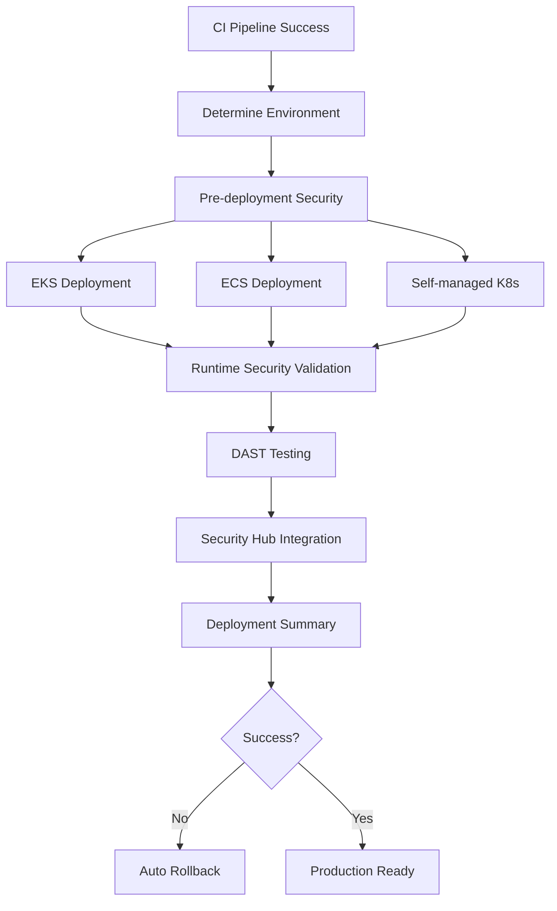

# CD Pipeline Implementation Guide

## Overview
This guide details the implementation of the enterprise-grade CD pipeline with multi-platform deployment, runtime security enforcement, and comprehensive DAST testing.

## Architecture

### Multi-Platform Deployment Flow


## Key Components

### 1. Pre-deployment Security Validation
- **Container Image Scanning**: Grype + Trivy vulnerability assessment
- **Image Signature Verification**: Cosign keyless verification
- **ASFF Integration**: Security findings to AWS Security Hub

### 2. Runtime Security Enforcement
- **Kyverno Policies**: Image signing, SBOM attestation, security contexts
- **Network Policies**: Zero-trust networking with default deny
- **Resource Limits**: Mandatory CPU/memory constraints

### 3. Dynamic Application Security Testing
- **OWASP ZAP Integration**: Automated security testing of deployed apps
- **Security Hub Findings**: DAST results in standardized format
- **Environment-based Thresholds**: Production vs development security gates

### 4. Multi-Platform Support
- **Amazon EKS**: Managed Kubernetes with advanced security
- **Amazon ECS**: Container service with task-level security
- **Self-managed K8s**: On-premises or custom cluster deployment

## Implementation Details

### Security Gates Configuration
```yaml
# Pre-deployment validation
pre-deployment-validation:
  - container_image_scan: grype + trivy
  - signature_verification: cosign keyless
  - vulnerability_threshold: environment-based
  - asff_integration: security_hub

# Runtime security
runtime-security:
  - kyverno_policies: enforce
  - network_policies: default_deny
  - pod_security: restricted
  - resource_limits: required
```

### Environment Strategy
- **Development**: EKS only, relaxed security thresholds
- **Staging**: EKS + ECS, production-like validation
- **Production**: All platforms, strict security enforcement

### Rollback Mechanism
- **Automatic Trigger**: Security validation failures
- **Kubernetes Rollback**: Previous deployment restoration
- **Health Checks**: Application availability verification

## Usage

### Triggering CD Pipeline
```bash
# Automatic trigger after successful CI
git push origin main  # Triggers production deployment
git push origin develop  # Triggers staging deployment
```

### Manual Deployment
```bash
# Using GitHub CLI
gh workflow run cd-pipeline.yml \
  --ref main \
  --field environment=production
```

### Monitoring Deployment
```bash
# Check deployment status
kubectl get deployments -n sbom-security-pipeline-production

# View security policies
kubectl get clusterpolicy

# Check DAST results
aws securityhub get-findings --filters '{"ProductName":[{"Value":"OWASP ZAP","Comparison":"EQUALS"}]}'
```

## Security Features

### ICS Security Integration
- **Network Segmentation**: DMZ/Application/Data zones
- **Runtime Protection**: Continuous policy enforcement
- **Threat Detection**: Real-time security monitoring
- **Compliance Validation**: Automated framework checks

### Supply Chain Security
- **Image Signing**: Cosign with OIDC identity
- **SBOM Attestation**: Software bill of materials validation
- **Vulnerability Scanning**: Multi-tool assessment
- **Policy Enforcement**: Admission controller validation

This CD pipeline provides enterprise-grade deployment capabilities with comprehensive security validation and multi-platform support.