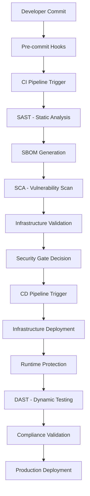

# Enterprise DevSecOps Pipeline - Detailed Implementation Guide

## Table of Contents
1. [Architecture Overview](#architecture-overview)
2. [Prerequisites & Setup](#prerequisites--setup)
3. [Reusable Workflows Deep Dive](#reusable-workflows-deep-dive)
4. [Terragrunt DRY Configuration](#terragrunt-dry-configuration)
5. [Security Implementation](#security-implementation)
6. [Deployment Guide](#deployment-guide)
7. [Monitoring & Observability](#monitoring--observability)
8. [Troubleshooting](#troubleshooting)

## Architecture Overview

### Shift-Left Security Pipeline


### ICS Security Domains Mapping
| ICS Domain | Cloud Implementation | Security Controls |
|------------|---------------------|-------------------|
| **Network Security** | VPC Segmentation | NACLs, Security Groups, Flow Logs |
| **Endpoint Security** | Container Hardening | Pod Security, Image Scanning |
| **Application Security** | WAF + SAST/DAST | CodeQL, Snyk, OWASP ZAP |
| **Database Security** | Encrypted RDS | KMS, IAM, Audit Logs |
| **Threat Intelligence** | AWS Security Hub | GuardDuty, Config, CloudTrail |

## Prerequisites & Setup

### Required Tools
```bash
# Core Infrastructure Tools
aws --version          # AWS CLI v2.15.0+
terraform --version    # Terraform v1.6.0+
terragrunt --version   # Terragrunt v0.55.0+
kubectl version        # Kubernetes CLI v1.28+

# Security Tools
syft --version         # SBOM generation v0.98.0+
grype --version        # Vulnerability scanning v0.74.0+
cosign version         # Container signing v2.2.0+
docker --version       # Docker Engine v24.0+

# Development Tools
git --version          # Git v2.40+
jq --version          # JSON processor v1.6+
```

### AWS Account Setup
```bash
# 1. Configure AWS CLI with appropriate permissions
aws configure

# 2. Verify account access
aws sts get-caller-identity

# 3. Create OIDC provider for GitHub Actions
aws iam create-open-id-connect-provider \
  --url https://token.actions.githubusercontent.com \
  --client-id-list sts.amazonaws.com \
  --thumbprint-list 6938fd4d98bab03faadb97b34396831e3780aea1

# 4. Create IAM role for GitHub Actions
cat > github-trust-policy.json <<EOF
{
  "Version": "2012-10-17",
  "Statement": [
    {
      "Effect": "Allow",
      "Principal": {
        "Federated": "arn:aws:iam::ACCOUNT-ID:oidc-provider/token.actions.githubusercontent.com"
      },
      "Action": "sts:AssumeRole",
      "Condition": {
        "StringEquals": {
          "token.actions.githubusercontent.com:aud": "sts.amazonaws.com"
        },
        "StringLike": {
          "token.actions.githubusercontent.com:sub": "repo:YOUR-ORG/sbom-security-pipeline:*"
        }
      }
    }
  ]
}
EOF

aws iam create-role \
  --role-name GitHubActionsRole \
  --assume-role-policy-document file://github-trust-policy.json

aws iam attach-role-policy \
  --role-name GitHubActionsRole \
  --policy-arn arn:aws:iam::aws:policy/PowerUserAccess
```

### GitHub Repository Setup
```bash
# 1. Clone and setup repository
git clone https://github.com/YOUR-ORG/sbom-security-pipeline.git
cd sbom-security-pipeline

# 2. Configure GitHub secrets
gh secret set AWS_ROLE_ARN --body "arn:aws:iam::ACCOUNT-ID:role/GitHubActionsRole"
gh secret set SNYK_TOKEN --body "YOUR-SNYK-TOKEN"

# 3. Enable GitHub Actions
gh workflow enable ci-pipeline.yml
gh workflow enable cd-pipeline.yml
```

## Reusable Workflows Deep Dive

### Security Gates Workflow Architecture

#### Input Parameters
```yaml
inputs:
  application_path:     # Path to scan (default: '.')
  container_image:      # Pre-built image to scan
  environment:          # Target environment (dev/staging/production)
  fail_on_severity:     # Vulnerability threshold (low/medium/high/critical)
  enable_dast:          # Enable dynamic testing
  dast_target_url:      # DAST target URL
```

#### Security Scanning Stages

##### 1. SAST (Static Application Security Testing)
```yaml
# CodeQL Configuration
- name: Initialize CodeQL
  uses: github/codeql-action/init@v3
  with:
    languages: javascript,python,go,java,csharp
    queries: +security-and-quality
    config-file: .github/codeql/codeql-config.yml
```

**Supported Languages & Queries:**
- **JavaScript/TypeScript**: XSS, injection flaws, insecure dependencies
- **Python**: SQL injection, command injection, path traversal
- **Go**: Memory safety, concurrency issues, crypto misuse
- **Java**: Deserialization, LDAP injection, XXE
- **C#**: Buffer overflows, format string vulnerabilities

##### 2. SBOM Generation with Supply Chain Security
```yaml
# SBOM Generation Process
- name: Generate SBOM with Syft
  uses: anchore/sbom-action@v0
  with:
    path: ${{ inputs.application_path }}
    format: cyclone-dx-json
    output-file: sbom-${{ inputs.environment }}.cyclone-dx.json

# Keyless Signing with Cosign
- name: Sign SBOM
  run: |
    cosign sign-blob \
      --output-signature sbom.json.sig \
      --output-certificate sbom.json.pem \
      sbom-${{ inputs.environment }}.cyclone-dx.json
  env:
    COSIGN_EXPERIMENTAL: 1
```

**SBOM Components Tracked:**
- Application dependencies (direct & transitive)
- Container base images and layers
- System packages and libraries
- License information
- Vulnerability mappings

##### 3. SCA (Software Composition Analysis)
```yaml
# Grype Vulnerability Scanning
- name: Vulnerability Scan with Grype
  uses: anchore/scan-action@v4
  with:
    sbom: sbom-${{ inputs.environment }}.cyclone-dx.json
    fail-build: true
    severity-cutoff: ${{ inputs.fail_on_severity }}
    output-format: json,sarif,table
```

**Vulnerability Sources:**
- **CVE Database**: Common Vulnerabilities and Exposures
- **GitHub Security Advisories**: Language-specific advisories
- **OS Security Updates**: Alpine, Ubuntu, RHEL security feeds
- **Language Ecosystems**: npm, PyPI, Maven, Go modules

##### 4. AWS Security Hub Integration
```python
# ASFF (AWS Security Finding Format) Conversion
def convert_grype_to_asff(grype_file, environment):
    """Convert Grype JSON output to AWS Security Finding Format"""
    findings = []
    for match in grype_data.get('matches', []):
        finding = {
            "SchemaVersion": "2018-10-08",
            "Id": f"grype-{vulnerability['id']}-{artifact['name']}",
            "ProductArn": "arn:aws:securityhub:region::product/anchore/grype",
            "Severity": {"Label": vulnerability.get('severity', 'INFORMATIONAL').upper()},
            "Title": f"Vulnerability {vulnerability['id']} in {artifact['name']}",
            "Resources": [{
                "Id": f"arn:aws:devsecops:{environment}:package:{artifact['name']}",
                "Type": "Other"
            }]
        }
        findings.append(finding)
    return findings
```

### Workflow Chaining Pattern

#### CI Pipeline Orchestration
```yaml
jobs:
  validate:
    outputs:
      environment: ${{ steps.determine_env.outputs.environment }}
      
  security-gates:
    needs: validate
    uses: ./.github/workflows/_reusable/security-gates.yml
    with:
      environment: ${{ needs.validate.outputs.environment }}
      fail_on_severity: 'high'
    secrets:
      AWS_ROLE_ARN: ${{ secrets.AWS_ROLE_ARN }}
      
  infrastructure-validation:
    needs: [validate, security-gates]
    if: ${{ needs.security-gates.outputs.security_passed == 'true' }}
```

#### Environment-Based Routing
```bash
# Branch-to-Environment Mapping
if [[ "${{ github.ref_name }}" == "main" ]]; then
  echo "environment=production" >> $GITHUB_OUTPUT
elif [[ "${{ github.ref_name }}" == "develop" ]]; then
  echo "environment=staging" >> $GITHUB_OUTPUT
else
  echo "environment=dev" >> $GITHUB_OUTPUT
fi
```

## Terragrunt DRY Configuration

### Inheritance Hierarchy
```
terragrunt/
├── terragrunt.hcl                    # Root configuration
└── environments/
    ├── dev/
    │   ├── terragrunt.hcl            # Dev overrides
    │   └── network-security/
    │       └── terragrunt.hcl        # Module-specific config
    ├── staging/
    └── production/
```

### Root Configuration Deep Dive

#### Remote State Management
```hcl
remote_state {
  backend = "s3"
  generate = {
    path      = "backend.tf"
    if_exists = "overwrite_terragrunt"
  }
  config = {
    bucket = "devsecops-terraform-state-${get_aws_account_id()}"
    key    = "${path_relative_to_include()}/terraform.tfstate"
    region = "us-west-2"
    encrypt = true
    dynamodb_table = "terraform-locks"
    
    # Versioning for state recovery
    s3_bucket_tags = {
      Name         = "Terraform State Bucket"
      ICSCompliant = "true"
      Purpose      = "terraform-state"
    }
  }
}
```

#### Provider Generation
```hcl
generate "provider" {
  path = "provider.tf"
  if_exists = "overwrite_terragrunt"
  contents = <<EOF
terraform {
  required_version = ">= 1.6"
  required_providers {
    aws = {
      source  = "hashicorp/aws"
      version = "~> 5.98.0"
    }
  }
}

provider "aws" {
  region = var.aws_region
  default_tags {
    tags = {
      ManagedBy    = "Terraform"
      Project      = "DevSecOps-Pipeline"
      ICSCompliant = "true"
      Environment  = var.environment
    }
  }
}
EOF
}
```

### Environment-Specific Configurations

#### Development Environment
```hcl
# terragrunt/environments/dev/terragrunt.hcl
include {
  path = find_in_parent_folders()
}

inputs = {
  environment = "dev"
  vpc_cidr = "10.10.0.0/16"
  availability_zones = ["us-west-2a", "us-west-2b"]
  log_retention_days = 3
  
  common_tags = {
    Environment    = "development"
    AutoShutdown   = "true"
    BackupRequired = "false"
  }
}
```

#### Production Environment
```hcl
# terragrunt/environments/production/terragrunt.hcl
include {
  path = find_in_parent_folders()
}

inputs = {
  environment = "production"
  vpc_cidr = "10.0.0.0/16"
  availability_zones = ["us-west-2a", "us-west-2b", "us-west-2c"]
  log_retention_days = 90
  
  common_tags = {
    Environment     = "production"
    CriticalSystem  = "true"
    BackupRequired  = "true"
    MonitoringLevel = "enhanced"
  }
}
```

### Module Configuration Pattern
```hcl
# terragrunt/environments/dev/network-security/terragrunt.hcl
include {
  path = find_in_parent_folders()
}

terraform {
  source = "../../../terraform/modules//network-security"
}

inputs = {
  private_subnet_cidrs = ["10.10.1.0/24", "10.10.2.0/24"]
  public_subnet_cidrs  = ["10.10.101.0/24", "10.10.102.0/24"]
  database_subnet_cidrs = ["10.10.201.0/24", "10.10.202.0/24"]
}

dependencies {
  paths = []  # Network is foundational
}
```

## Security Implementation

### ICS Security Domain Implementation

#### Network Security (Domain 1)
```hcl
# VPC with ICS-grade segmentation
resource "aws_vpc" "main" {
  cidr_block           = var.vpc_cidr
  enable_dns_hostnames = true
  enable_dns_support   = true
  
  tags = merge(var.common_tags, {
    Name         = "${var.project_name}-${var.environment}-vpc"
    SecurityZone = "dmz"
    ICSFunction  = "network-segmentation"
  })
}

# Network ACLs for defense-in-depth
resource "aws_network_acl" "dmz" {
  vpc_id     = aws_vpc.main.id
  subnet_ids = aws_subnet.public[*].id
  
  # Explicit allow rules only
  ingress {
    protocol   = "tcp"
    rule_no    = 100
    action     = "allow"
    cidr_block = "0.0.0.0/0"
    from_port  = 443
    to_port    = 443
  }
  
  tags = merge(var.common_tags, {
    Name        = "${var.project_name}-${var.environment}-dmz-nacl"
    ICSFunction = "network-access-control"
  })
}
```

#### Endpoint Security (Domain 2)
```yaml
# Kubernetes Pod Security Standards
apiVersion: v1
kind: Pod
spec:
  securityContext:
    runAsNonRoot: true
    runAsUser: 1000
    fsGroup: 1000
    seccompProfile:
      type: RuntimeDefault
  containers:
  - name: app
    securityContext:
      allowPrivilegeEscalation: false
      readOnlyRootFilesystem: true
      capabilities:
        drop: ["ALL"]
      runAsNonRoot: true
```

#### Application Security (Domain 3)
```hcl
# WAF with OWASP Top 10 protection
resource "aws_wafv2_web_acl" "main" {
  name  = "${var.project_name}-${var.environment}-waf"
  scope = "REGIONAL"

  rule {
    name     = "AWSManagedRulesCommonRuleSet"
    priority = 1
    
    statement {
      managed_rule_group_statement {
        name        = "AWSManagedRulesCommonRuleSet"
        vendor_name = "AWS"
      }
    }
    
    visibility_config {
      cloudwatch_metrics_enabled = true
      metric_name                = "CommonRuleSetMetric"
      sampled_requests_enabled   = true
    }
  }
}
```

#### Database Security (Domain 4)
```hcl
# Encrypted RDS with KMS
resource "aws_db_instance" "main" {
  identifier = "${var.project_name}-${var.environment}-db"
  
  # Encryption configuration
  storage_encrypted = true
  kms_key_id       = aws_kms_key.rds.arn
  
  # Network isolation
  db_subnet_group_name   = aws_db_subnet_group.main.name
  vpc_security_group_ids = [aws_security_group.rds.id]
  publicly_accessible    = false
  
  # Backup and monitoring
  backup_retention_period = var.environment == "production" ? 30 : 7
  monitoring_interval     = 60
  monitoring_role_arn     = aws_iam_role.rds_monitoring.arn
  
  # Audit logging
  enabled_cloudwatch_logs_exports = ["postgresql"]
}
```

### Container Security Implementation

#### Multi-Stage Dockerfile
```dockerfile
# Builder stage
FROM python:3.11-slim as builder
RUN groupadd -r appuser && useradd -r -g appuser appuser
WORKDIR /app
COPY requirements.txt .
RUN pip install --no-cache-dir --user -r requirements.txt

# Production stage
FROM python:3.11-slim
RUN groupadd -r appuser && useradd -r -g appuser appuser

# Security updates only
RUN apt-get update && apt-get upgrade -y && \
    apt-get install -y --no-install-recommends ca-certificates && \
    rm -rf /var/lib/apt/lists/*

# Copy dependencies from builder
COPY --from=builder /root/.local /home/appuser/.local

WORKDIR /app
COPY --chown=appuser:appuser . .

# Remove write permissions
RUN chmod -R 555 /app

# Switch to non-root user
USER appuser

# Security environment variables
ENV PYTHONDONTWRITEBYTECODE=1
ENV PYTHONUNBUFFERED=1
ENV PATH=/home/appuser/.local/bin:$PATH

EXPOSE 8080
CMD ["python", "app.py"]
```

#### Kyverno Security Policies
```yaml
apiVersion: kyverno.io/v1
kind: ClusterPolicy
metadata:
  name: require-pod-security-standards
spec:
  validationFailureAction: enforce
  rules:
  - name: check-security-context
    match:
      any:
      - resources:
          kinds: [Pod]
    validate:
      message: "Pod must run as non-root with read-only filesystem"
      pattern:
        spec:
          securityContext:
            runAsNonRoot: true
            runAsUser: ">1000"
          containers:
          - name: "*"
            securityContext:
              allowPrivilegeEscalation: false
              readOnlyRootFilesystem: true
              capabilities:
                drop: [ALL]
```

## Deployment Guide

### Step-by-Step Deployment

#### 1. Environment Bootstrap
```bash
# Run bootstrap script
./scripts/bootstrap.sh

# Verify AWS setup
aws sts get-caller-identity
aws s3 ls | grep terraform-state

# Check Terragrunt configuration
cd terragrunt/environments/dev
terragrunt validate-inputs
```

#### 2. Infrastructure Deployment
```bash
# Deploy network security (foundational)
cd terragrunt/environments/dev/network-security
terragrunt init
terragrunt plan
terragrunt apply

# Deploy application security
cd ../application-security
terragrunt init
terragrunt apply

# Deploy database security
cd ../database-security
terragrunt apply
```

#### 3. Application Deployment
```bash
# Build and push container
docker build -t ghcr.io/your-org/sbom-security-pipeline:latest app/
docker push ghcr.io/your-org/sbom-security-pipeline:latest

# Deploy to Kubernetes
kubectl apply -k kubernetes/overlays/dev/

# Verify deployment
kubectl get pods -l app=sbom-security-pipeline
kubectl logs -l app=sbom-security-pipeline
```

#### 4. Security Validation
```bash
# Run security validation
./scripts/security-validation.sh

# Check compliance
./scripts/compliance-check.sh

# Verify Security Hub findings
aws securityhub get-findings --region us-west-2
```

### Environment Promotion

#### Dev → Staging
```bash
# Merge to develop branch
git checkout develop
git merge feature/your-feature
git push origin develop

# Monitor CI/CD pipeline
gh workflow view ci-pipeline.yml
gh workflow view cd-pipeline.yml
```

#### Staging → Production
```bash
# Create release PR
gh pr create --base main --head develop --title "Release v1.0.0"

# After approval and merge
git checkout main
git pull origin main

# Monitor production deployment
kubectl get pods -n sbom-security-pipeline-production
```

## Monitoring & Observability

### Security Metrics Dashboard

#### Key Performance Indicators
```bash
# Vulnerability metrics
MTTR_VULNERABILITIES="Mean Time to Remediate vulnerabilities"
VULNERABILITY_COUNT="Active vulnerability count by severity"
SBOM_COVERAGE="Percentage of components with SBOM"

# Security gate metrics
SECURITY_GATE_PASS_RATE="Percentage of builds passing security gates"
FALSE_POSITIVE_RATE="Security scan false positive percentage"
SCAN_DURATION="Average security scan duration"

# Compliance metrics
COMPLIANCE_SCORE="Overall compliance percentage across frameworks"
POLICY_VIOLATIONS="Active policy violation count"
AUDIT_COVERAGE="Percentage of resources with audit logging"
```

#### CloudWatch Dashboards
```json
{
  "widgets": [
    {
      "type": "metric",
      "properties": {
        "metrics": [
          ["AWS/SecurityHub", "Findings", "ComplianceType", "PASSED"],
          [".", ".", ".", "FAILED"]
        ],
        "period": 300,
        "stat": "Sum",
        "region": "us-west-2",
        "title": "Security Hub Compliance Status"
      }
    },
    {
      "type": "log",
      "properties": {
        "query": "SOURCE '/aws/vpc/flowlogs' | fields @timestamp, srcaddr, dstaddr, action\n| filter action = \"REJECT\"\n| stats count() by srcaddr\n| sort count desc\n| limit 20",
        "region": "us-west-2",
        "title": "Top Rejected Source IPs"
      }
    }
  ]
}
```

### Alerting Configuration

#### Security Alerts
```yaml
# CloudWatch Alarms
CriticalVulnerabilityAlarm:
  Type: AWS::CloudWatch::Alarm
  Properties:
    AlarmName: CriticalVulnerabilitiesDetected
    MetricName: CriticalFindings
    Namespace: SecurityHub
    Statistic: Sum
    Period: 300
    EvaluationPeriods: 1
    Threshold: 1
    ComparisonOperator: GreaterThanOrEqualToThreshold
    AlarmActions:
      - !Ref SecurityTeamTopic

SecurityGateFailureAlarm:
  Type: AWS::CloudWatch::Alarm
  Properties:
    AlarmName: SecurityGateFailure
    MetricName: FailedBuilds
    Namespace: GitHub/Actions
    Statistic: Sum
    Period: 300
    Threshold: 1
    ComparisonOperator: GreaterThanOrEqualToThreshold
```

## Troubleshooting

### Common Issues and Solutions

#### 1. Security Gate Failures
```bash
# Issue: SAST scan failing with false positives
# Solution: Configure CodeQL custom queries
cat > .github/codeql/codeql-config.yml <<EOF
name: "Custom CodeQL Config"
queries:
  - uses: security-and-quality
  - uses: security-extended
disable-default-queries: false
query-filters:
  - exclude:
      id: js/unused-local-variable
EOF
```

#### 2. SBOM Generation Issues
```bash
# Issue: Syft not detecting all dependencies
# Solution: Configure Syft cataloger
cat > .syft.yaml <<EOF
catalogers:
  enabled:
    - python-package-cataloger
    - javascript-package-cataloger
    - go-module-binary-cataloger
    - java-cataloger
package:
  cataloger:
    enabled: true
    scope: all-layers
EOF
```

#### 3. Terragrunt State Issues
```bash
# Issue: State lock conflicts
# Solution: Force unlock (use carefully)
terragrunt force-unlock LOCK-ID

# Issue: State drift detection
# Solution: Refresh and plan
terragrunt refresh
terragrunt plan -detailed-exitcode
```

#### 4. Container Security Issues
```bash
# Issue: Pod security policy violations
# Solution: Check security context
kubectl describe pod POD-NAME
kubectl get events --field-selector involvedObject.name=POD-NAME

# Issue: Image vulnerability scan failures
# Solution: Update base image and rebuild
docker pull python:3.11-slim
docker build --no-cache -t app:latest .
```

### Debug Commands

#### Security Scanning Debug
```bash
# Debug SBOM generation
syft . -o cyclonedx-json --verbose

# Debug vulnerability scanning
grype . --verbose --output json

# Debug container scanning
trivy image --debug your-image:tag
```

#### Infrastructure Debug
```bash
# Debug Terragrunt
terragrunt plan --terragrunt-log-level debug

# Debug AWS permissions
aws sts get-caller-identity
aws iam simulate-principal-policy \
  --policy-source-arn arn:aws:iam::ACCOUNT:role/GitHubActionsRole \
  --action-names s3:GetObject \
  --resource-arns arn:aws:s3:::bucket/*
```

#### Kubernetes Debug
```bash
# Debug pod security
kubectl auth can-i create pods --as=system:serviceaccount:default:default
kubectl get psp,podsecuritypolicy
kubectl describe networkpolicy default-deny-all
```

This comprehensive guide provides detailed implementation instructions for every component of the enterprise DevSecOps pipeline with ICS security integration.