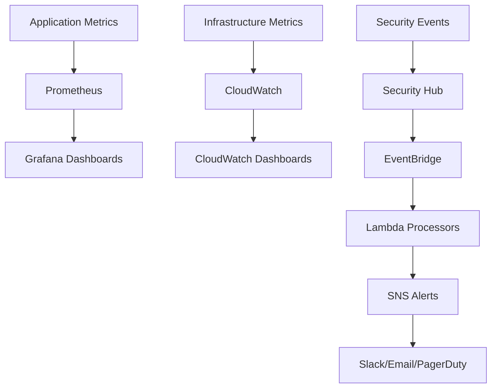

# Comprehensive Monitoring & Alerting Guide

## Overview
This guide details the implementation of enterprise-grade monitoring and alerting that provides real-time visibility across the entire DevSecOps pipeline with ICS security principles.

## Architecture

### Monitoring Stack Components


## Key Components

### 1. CloudWatch Integration
- **Custom Dashboards**: DevSecOps pipeline overview, security metrics
- **Log Metric Filters**: Security events, vulnerability counts, policy violations
- **Alarms**: Critical security events, high vulnerability counts, WAF blocks
- **SNS Integration**: Multi-channel alert routing with severity-based escalation

### 2. Prometheus + Grafana Stack
- **Kubernetes Monitoring**: Node metrics, pod performance, resource utilization
- **Security Metrics**: Falco events, Kyverno violations, privileged containers
- **Custom Alerts**: Memory/CPU thresholds, security policy violations
- **Grafana Dashboards**: Real-time visualization with security focus

### 3. Security Hub Integration
- **Centralized Findings**: All security scan results in standardized format
- **Compliance Monitoring**: CIS, AWS Foundational, PCI DSS standards
- **Automated Processing**: Lambda functions for finding enrichment
- **EventBridge Integration**: Real-time security event processing

### 4. Multi-Platform Alerting
- **Intelligent Routing**: Severity-based notification channels
- **Context Enrichment**: Security Hub correlation, remediation links
- **Escalation Policies**: Critical → High → Medium alert flows
- **Integration Support**: Slack, email, PagerDuty, custom webhooks

## Implementation Details

### CloudWatch Metrics
```yaml
# Custom security metrics
DevSecOps/Security:
  - VulnerabilitiesFound: Count of vulnerabilities by severity
  - SecurityGatesPassed: Successful security gate validations
  - SecurityGatesFailed: Failed security gate validations
  - PolicyViolations: Kyverno policy violation count

DevSecOps/Compliance:
  - ComplianceScore: Overall compliance percentage
  - FailedControls: Count of failed compliance controls
```

### Prometheus Metrics
```yaml
# Container and security metrics
falco_events_total: Security events detected by Falco
kyverno_policy_violations_total: Policy violations by Kyverno
kube_pod_container_info: Container security context information
node_memory_MemAvailable_bytes: Available memory per node
```

### Alert Severity Levels
- **CRITICAL**: Security breaches, system compromises, production outages
- **HIGH**: Security policy violations, high-severity vulnerabilities
- **MEDIUM**: Resource threshold breaches, medium-severity findings
- **LOW**: Informational alerts, minor configuration issues

## Configuration

### Environment Variables
```bash
# Monitoring configuration
ENVIRONMENT=production
SLACK_WEBHOOK_URL=https://hooks.slack.com/services/...
VULNERABILITY_THRESHOLD=10
ALERT_EMAIL=security-team@company.com
```

### Terraform Deployment
```bash
# Deploy monitoring infrastructure
cd terragrunt/environments/production/monitoring
terragrunt apply

# Deploy Security Hub integration
cd ../security-hub-integration
terragrunt apply
```

### Kubernetes Deployment
```bash
# Deploy Prometheus + Grafana stack
kubectl apply -f kubernetes/monitoring/prometheus-stack.yaml

# Verify deployment
kubectl get pods -n monitoring
kubectl port-forward -n monitoring svc/grafana 3000:3000
```

## Dashboard Access

### CloudWatch Dashboards
- **DevSecOps Overview**: https://console.aws.amazon.com/cloudwatch/home#dashboards:name=production-devsecops-overview
- **Security Hub**: https://console.aws.amazon.com/cloudwatch/home#dashboards:name=production-security-hub-overview

### Grafana Dashboards
- **Local Access**: http://localhost:3000 (admin/admin123)
- **Cluster Access**: kubectl port-forward -n monitoring svc/grafana 3000:3000

### Security Hub Console
- **Findings**: https://console.aws.amazon.com/securityhub/home#/findings
- **Standards**: https://console.aws.amazon.com/securityhub/home#/standards

## Alert Configuration

### Slack Integration
```json
{
  "webhook_url": "https://hooks.slack.com/services/...",
  "channel": "#security-alerts",
  "username": "DevSecOps Monitor",
  "icon_emoji": ":rotating_light:"
}
```

### Email Notifications
```yaml
# SNS topic subscriptions
critical_alerts:
  - security-team@company.com
  - on-call@company.com

security_alerts:
  - security-team@company.com
  - devops-team@company.com
```

## Monitoring Best Practices

### ICS Security Principles Applied
1. **Continuous Monitoring**: Real-time metrics collection and analysis
2. **Defense in Depth**: Multiple monitoring layers (infrastructure, application, security)
3. **Centralized Management**: Unified dashboards and alert routing
4. **Automated Response**: Lambda-based alert processing and enrichment

### Alert Fatigue Prevention
- **Severity-based Routing**: Critical alerts to immediate channels
- **Correlation**: Group related alerts to reduce noise
- **Suppression**: Temporary alert silencing during maintenance
- **Escalation**: Automatic escalation for unacknowledged critical alerts

### Performance Optimization
- **Metric Retention**: 7 days for Prometheus, 90 days for CloudWatch
- **Sampling**: Reduce high-cardinality metrics in production
- **Aggregation**: Pre-aggregate common queries for faster dashboards
- **Caching**: Cache dashboard queries to reduce load

## Troubleshooting

### Common Issues
```bash
# Prometheus not scraping metrics
kubectl logs -n monitoring deployment/prometheus
kubectl get servicemonitor -A

# Grafana dashboard not loading
kubectl logs -n monitoring deployment/grafana
kubectl get configmap -n monitoring grafana-datasource-config

# CloudWatch alarms not triggering
aws logs describe-metric-filters --log-group-name /aws/lambda/security-scanner
aws cloudwatch get-metric-statistics --namespace DevSecOps/Security --metric-name SecurityEvents
```

### Health Checks
```bash
# Verify monitoring stack health
curl http://prometheus:9090/-/healthy
curl http://grafana:3000/api/health

# Check Security Hub integration
aws securityhub get-enabled-standards
aws events list-rules --name-prefix security-hub
```

This comprehensive monitoring system provides enterprise-grade observability with ICS security principles, ensuring complete visibility across your DevSecOps pipeline.