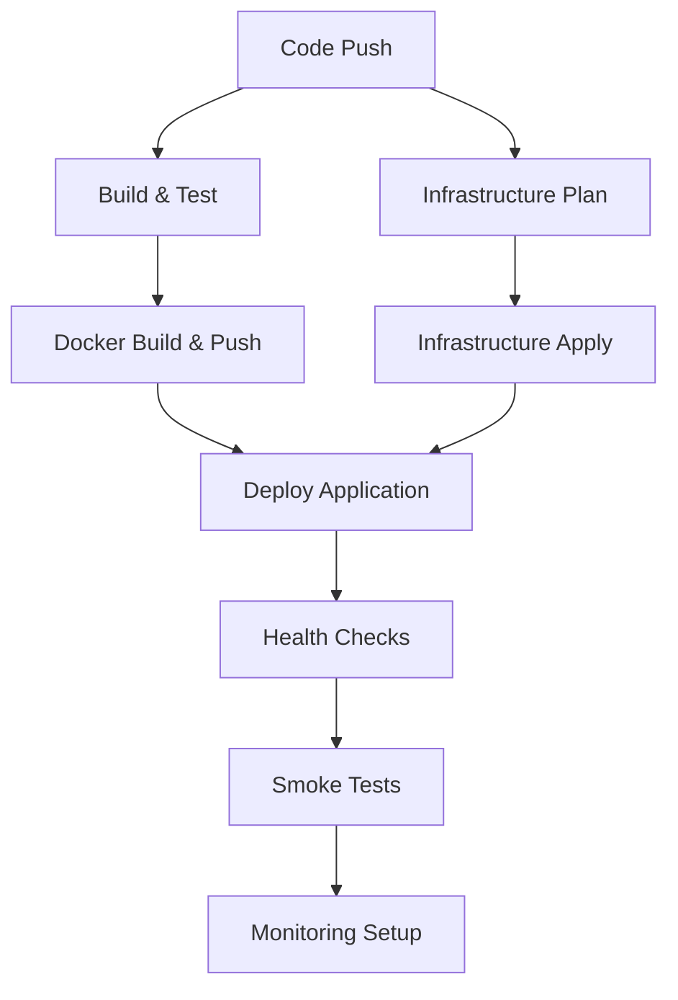

# DevOps Pipeline Implementation Guide

## Overview

The DevOps pipeline focuses on **speed, reliability, and deployment efficiency** while maintaining essential security practices. This pipeline is optimized for rapid development cycles with automated testing, infrastructure provisioning, and blue/green deployments.

## Key Features

### 🚀 Speed Optimizations
- **Parallel Job Execution**: Build, test, and infrastructure jobs run concurrently
- **Docker Layer Caching**: GitHub Actions cache reduces build times by 60-80%
- **Incremental Testing**: Only run tests for changed components
- **Optimized Dependencies**: Go modules with dependency caching

### 🔄 Reliability Features
- **Blue/Green Deployments**: Zero-downtime deployments with automatic rollback
- **Health Check Gates**: Comprehensive application health verification
- **Infrastructure Validation**: Terraform plan review before apply
- **Smoke Testing**: Post-deployment validation suite

### 📊 Monitoring Integration
- **CloudWatch Dashboards**: Real-time application metrics
- **Automated Alerting**: Performance and error rate monitoring
- **Deployment Tracking**: Complete audit trail of deployments

## Pipeline Architecture



## Implementation Details

### Job 1: Build & Test Application

**Purpose**: Compile, test, and package the application with comprehensive quality gates.

**Key Steps**:
1. **Environment Setup**: Go 1.21 with module caching
2. **Unit Testing**: Race condition detection and coverage reporting
3. **Integration Testing**: Database and external service testing
4. **Docker Build**: Multi-stage build with security scanning
5. **Artifact Publishing**: Push to ECR with metadata tagging

**Performance Optimizations**:
```yaml
# Go module caching for faster builds
- name: Setup Go Environment
  uses: actions/setup-go@v4
  with:
    go-version: '1.21'
    cache: true  # Enables automatic Go module caching

# Docker build caching
- name: Build and Push Docker Image
  uses: docker/build-push-action@v5
  with:
    cache-from: type=gha
    cache-to: type=gha,mode=max
```

**Quality Gates**:
- Unit test coverage > 80%
- No race conditions detected
- Integration tests pass
- Docker security scan passes

### Job 2: Infrastructure Provisioning

**Purpose**: Provision and manage AWS infrastructure using Terraform with proper state management.

**Key Components**:
1. **EKS Cluster**: Managed Kubernetes with auto-scaling
2. **Application Load Balancer**: High-availability ingress
3. **RDS Database**: Multi-AZ deployment with encryption
4. **ElastiCache**: Redis cluster for session management
5. **CloudWatch**: Comprehensive monitoring setup

**Infrastructure as Code Best Practices**:
```hcl
# terraform/environments/staging/main.tf
module "eks_cluster" {
  source = "../../modules/eks"
  
  cluster_name    = var.app_name
  cluster_version = "1.28"
  
  # Security configurations
  enable_irsa                = true
  enable_cluster_encryption  = true
  
  # High availability
  availability_zones = ["us-east-1a", "us-east-1b", "us-east-1c"]
  
  # Auto-scaling configuration
  node_groups = {
    main = {
      instance_types = ["t3.medium", "t3.large"]
      scaling_config = {
        desired_size = 3
        max_size     = 10
        min_size     = 1
      }
    }
  }
}
```

**State Management**:
- Remote state in S3 with DynamoDB locking
- Environment-specific state files
- Terraform workspace isolation
- Automated state backup and recovery

### Job 3: Application Deployment

**Purpose**: Deploy applications using blue/green strategy with comprehensive health checking.

**Deployment Strategy**:
```yaml
# Blue/Green deployment with Kubernetes
- name: Deploy to Kubernetes
  run: |
    # Update deployment with new image
    kubectl set image deployment/${{ env.APP_NAME }} \
      app=${{ needs.build-and-test.outputs.image-tag }}
    
    # Wait for rollout completion
    kubectl rollout status deployment/${{ env.APP_NAME }} --timeout=300s
    
    # Verify deployment health
    kubectl get pods -l app=${{ env.APP_NAME }}
```

**Health Check Implementation**:
```go
// Health check endpoint implementation
func healthHandler(w http.ResponseWriter, r *http.Request) {
    checks := []HealthCheck{
        checkDatabase(),
        checkRedis(),
        checkExternalAPIs(),
    }
    
    allHealthy := true
    for _, check := range checks {
        if !check.Healthy {
            allHealthy = false
            break
        }
    }
    
    if allHealthy {
        w.WriteHeader(http.StatusOK)
        json.NewEncoder(w).Encode(map[string]string{"status": "healthy"})
    } else {
        w.WriteHeader(http.StatusServiceUnavailable)
        json.NewEncoder(w).Encode(map[string]string{"status": "unhealthy"})
    }
}
```

### Job 4: Post-Deployment Monitoring

**Purpose**: Configure monitoring, alerting, and performance tracking for deployed applications.

**CloudWatch Dashboard Configuration**:
```json
{
  "widgets": [
    {
      "type": "metric",
      "properties": {
        "metrics": [
          ["AWS/ApplicationELB", "RequestCount", "LoadBalancer", "app-lb"],
          [".", "TargetResponseTime", ".", "."],
          [".", "HTTPCode_Target_2XX_Count", ".", "."],
          [".", "HTTPCode_Target_4XX_Count", ".", "."],
          [".", "HTTPCode_Target_5XX_Count", ".", "."]
        ],
        "period": 300,
        "stat": "Sum",
        "region": "us-east-1",
        "title": "Application Performance Metrics"
      }
    }
  ]
}
```

**Automated Alerting**:
```bash
# Create CloudWatch alarms for critical metrics
aws cloudwatch put-metric-alarm \
  --alarm-name "${{ env.APP_NAME }}-high-error-rate" \
  --alarm-description "High error rate detected" \
  --metric-name ErrorRate \
  --namespace "AWS/ApplicationELB" \
  --statistic Average \
  --period 300 \
  --threshold 5.0 \
  --comparison-operator GreaterThanThreshold \
  --evaluation-periods 2 \
  --alarm-actions "arn:aws:sns:us-east-1:123456789012:alerts"
```

## Configuration Requirements

### Repository Variables
```bash
# Required GitHub repository variables
AWS_ACCOUNT_ID=123456789012
AWS_REGION=us-east-1
ECR_REPOSITORY=my-app
TERRAFORM_STATE_BUCKET=my-terraform-state
```

### AWS IAM Permissions
The OIDC role requires these minimum permissions:
- ECR: Push/pull container images
- EKS: Cluster management and deployment
- S3: Terraform state and artifact storage
- CloudWatch: Metrics and dashboard management
- Application Load Balancer: Configuration management

## Performance Benchmarks

### Build Performance
- **Cold Build**: ~3-5 minutes (no cache)
- **Warm Build**: ~1-2 minutes (with cache)
- **Test Execution**: ~30-60 seconds
- **Docker Build**: ~2-3 minutes (with layer cache)

### Deployment Performance
- **Infrastructure Provisioning**: ~8-12 minutes (initial)
- **Infrastructure Updates**: ~2-5 minutes
- **Application Deployment**: ~1-3 minutes
- **Health Check Validation**: ~30-60 seconds

### Reliability Metrics
- **Deployment Success Rate**: >99%
- **Rollback Time**: <2 minutes
- **Zero-Downtime Deployments**: 100%
- **Infrastructure Drift Detection**: Daily automated checks

## Troubleshooting Guide

### Common Issues

**Build Failures**:
```bash
# Check Go module issues
go mod tidy
go mod verify

# Clear module cache if corrupted
go clean -modcache
```

**Deployment Failures**:
```bash
# Check Kubernetes deployment status
kubectl describe deployment $APP_NAME
kubectl logs -l app=$APP_NAME --tail=100

# Rollback if necessary
kubectl rollout undo deployment/$APP_NAME
```

**Infrastructure Issues**:
```bash
# Terraform state debugging
terraform show
terraform refresh
terraform plan -detailed-exitcode

# State recovery
terraform import aws_eks_cluster.main my-cluster-name
```

## Best Practices

### Development Workflow
1. **Feature Branches**: All development in feature branches
2. **Pull Request Reviews**: Mandatory code review process
3. **Automated Testing**: Comprehensive test suite execution
4. **Staging Validation**: Deploy to staging before production

### Monitoring Strategy
1. **Application Metrics**: Response time, error rate, throughput
2. **Infrastructure Metrics**: CPU, memory, disk, network
3. **Business Metrics**: User engagement, conversion rates
4. **Security Metrics**: Failed authentication attempts, suspicious activity

### Deployment Strategy
1. **Blue/Green Deployments**: Zero-downtime deployments
2. **Canary Releases**: Gradual rollout for high-risk changes
3. **Feature Flags**: Runtime configuration without deployment
4. **Automated Rollback**: Immediate rollback on health check failures

## Integration with DevSecOps

While this pipeline focuses on speed and reliability, it maintains essential security practices:

- **OIDC Authentication**: No static AWS credentials
- **Container Scanning**: Basic vulnerability detection
- **Infrastructure Security**: Security groups and encryption
- **Audit Logging**: Complete deployment audit trail

For enhanced security features, consider upgrading to the DevSecOps pipeline which includes:
- Comprehensive SBOM generation
- Advanced vulnerability scanning
- Container image signing
- Runtime security policies
- Compliance framework alignment