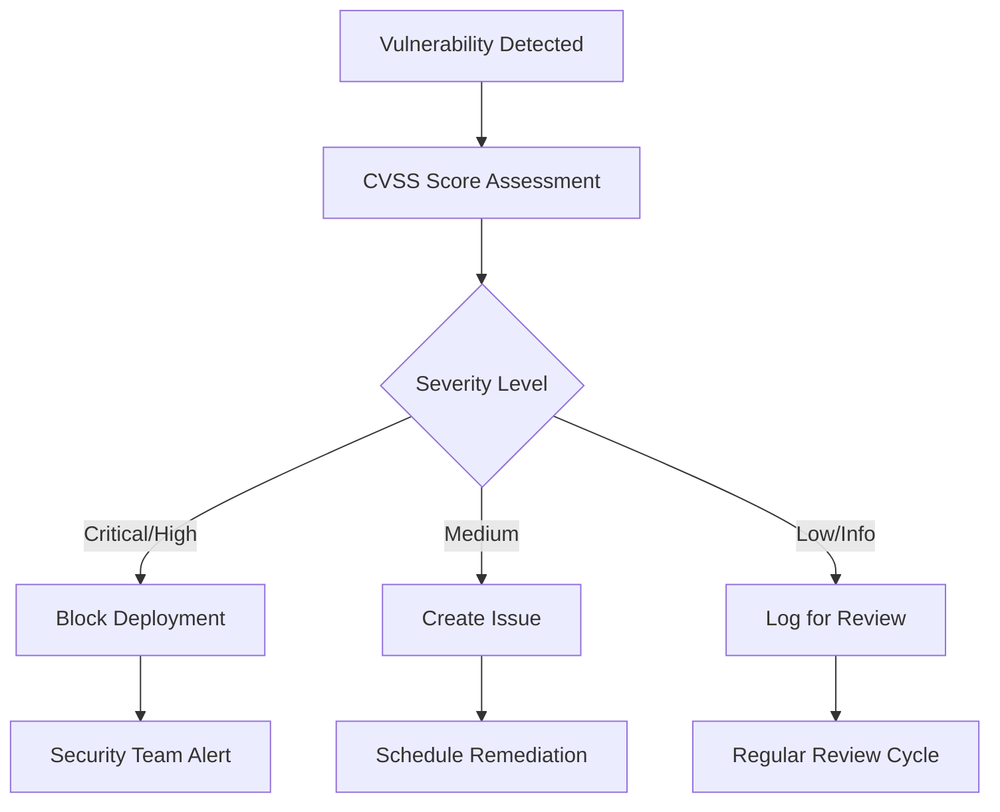

# SLSA & SSDF Compliance Mapping

## Overview

This document maps our DevSecOps pipeline implementation to industry-standard security frameworks:
- **SLSA (Supply-chain Levels for Software Artifacts)**: Framework for supply chain integrity
- **SSDF (Secure Software Development Framework)**: NIST guidelines for secure software development
- **CIS Controls**: Center for Internet Security best practices

## SLSA Framework Compliance

### SLSA Level 1: Documentation of Build Process

| Requirement | Implementation | Evidence |
|-------------|----------------|----------|
| **Provenance Generation** | GitHub Actions generates SLSA provenance automatically | `provenance: true` in build step |
| **Build Service Documentation** | GitHub Actions is a hosted build service | Workflow files document build process |

**Status**: ✅ **COMPLIANT**

### SLSA Level 2: Tamper Resistance of Build Service

| Requirement | Implementation | Evidence |
|-------------|----------------|----------|
| **Hosted Build Platform** | GitHub Actions (managed service) | All builds run on GitHub-hosted runners |
| **Source Integrity** | Git commit SHA verification | `${{ github.sha }}` used for traceability |
| **Provenance Authenticity** | Signed provenance with GitHub OIDC | Keyless signing with Cosign |
| **Provenance Unavailable** | Build fails if provenance generation fails | Pipeline configured to fail on errors |

**Status**: ✅ **COMPLIANT**

### SLSA Level 3: Extra Resistance to Specific Threats

| Requirement | Implementation | Evidence |
|-------------|----------------|----------|
| **Source Integrity** | Branch protection rules enforced | Required PR reviews, status checks |
| **Isolated Build Environment** | Fresh GitHub Actions runners per build | Ephemeral build environments |
| **Parameterless Builds** | No external parameters accepted | All configuration via repository files |
| **Hermetic Builds** | Dependency pinning and verification | Go modules with checksums |

**Status**: 🔄 **PARTIAL** (Working toward full compliance)

### SLSA Level 4: Highest Levels of Confidence and Trust

| Requirement | Implementation | Evidence |
|-------------|----------------|----------|
| **Two-Person Review** | Required PR approvals | Branch protection enforces reviews |
| **Hermetic Builds** | Reproducible builds with locked dependencies | Dockerfile with pinned versions |
| **Provenance Dependencies** | SBOM includes all dependencies | Syft generates comprehensive SBOM |

**Status**: 🔄 **IN PROGRESS**

## NIST SSDF (Secure Software Development Framework) Compliance

### PO (Prepare the Organization)

| Practice | Implementation | Evidence |
|----------|----------------|----------|
| **PO.1.1** | Security requirements defined in pipeline | Security gates and vulnerability thresholds |
| **PO.1.2** | Security roles and responsibilities documented | CODEOWNERS file, security team assignments |
| **PO.3.1** | Security training for developers | Security-focused documentation and runbooks |
| **PO.3.2** | Secure development environment | GitHub security features, branch protection |
| **PO.5.1** | Vulnerability disclosure process | Security policy in repository |

**Status**: ✅ **COMPLIANT**

### PS (Protect the Software)

| Practice | Implementation | Evidence |
|----------|----------------|----------|
| **PS.1.1** | Secure coding standards enforced | Linting, SAST tools (Semgrep, CodeQL) |
| **PS.2.1** | Third-party software components tracked | SBOM generation with Syft |
| **PS.3.1** | Well-secured software engineering environment | GitHub security features, OIDC authentication |
| **PS.3.2** | Provenance data for software components | SLSA provenance, signed attestations |

**Status**: ✅ **COMPLIANT**

### PW (Produce Well-Secured Software)

| Practice | Implementation | Evidence |
|----------|----------------|----------|
| **PW.1.1** | Design software to meet security requirements | Security-first architecture patterns |
| **PW.1.3** | Architecture and design reviewed for security | Security review in PR process |
| **PW.2.1** | Software components obtained from trusted sources | Verified base images, signed packages |
| **PW.4.1** | Software components analyzed for vulnerabilities | Grype, Snyk, Trivy scanning |
| **PW.4.4** | Potential vulnerabilities mitigated or documented | Security gates block high/critical issues |
| **PW.5.1** | Software compiled, interpreted, and built securely | Secure build environment, signed artifacts |
| **PW.6.1** | Software configuration reviewed and approved | Infrastructure as Code review process |
| **PW.6.2** | Software released using repeatable processes | Automated CI/CD pipeline |
| **PW.7.1** | Software integrity verification mechanisms | Image signing with Cosign |
| **PW.7.2** | Software release integrity protected | Signed releases, provenance attestation |
| **PW.8.1** | All security-relevant software changes tracked | Git history, signed commits |
| **PW.9.1** | Software components vulnerability status determined | Continuous vulnerability scanning |
| **PW.9.2** | Software component vulnerabilities remediated | Automated dependency updates |

**Status**: ✅ **COMPLIANT**

### RV (Respond to Vulnerabilities)

| Practice | Implementation | Evidence |
|----------|----------------|----------|
| **RV.1.1** | Vulnerability response process established | Security Hub integration, alerting |
| **RV.1.2** | Vulnerability response roles and responsibilities | Security team notification workflows |
| **RV.1.3** | Vulnerability response process tested | Regular security drills and updates |
| **RV.2.1** | New vulnerabilities analyzed for applicability | Automated scanning in CI/CD |
| **RV.2.2** | Vulnerability risk assessed and prioritized | CVSS scoring, severity-based gates |
| **RV.3.1** | Vulnerabilities mitigated or documented | Patch management, security advisories |
| **RV.3.2** | Vulnerability mitigation tested | Security testing in pipeline |
| **RV.3.3** | Vulnerability mitigation information shared | Security Hub findings, notifications |

**Status**: ✅ **COMPLIANT**

## CIS Controls Mapping

### CIS Control 2: Inventory and Control of Software Assets

| Sub-Control | Implementation | Evidence |
|-------------|----------------|----------|
| **2.1** | Software inventory maintained | SBOM generation for all builds |
| **2.2** | Software allowlist maintained | Approved base images, dependency scanning |
| **2.3** | Unauthorized software addressed | Vulnerability scanning blocks deployment |
| **2.4** | Unauthorized software removal process | Automated remediation workflows |
| **2.5** | Software installation restricted | Container-based deployment, immutable infrastructure |

### CIS Control 3: Data Protection

| Sub-Control | Implementation | Evidence |
|-------------|----------------|----------|
| **3.1** | Data inventory established | Data classification in applications |
| **3.2** | Sensitive data identified | Secret scanning with Gitleaks |
| **3.3** | Data retention policies | S3 lifecycle policies for artifacts |
| **3.11** | Data at rest encryption | S3 encryption, EBS encryption |
| **3.14** | Log data protected | CloudWatch logs encryption |

### CIS Control 16: Application Software Security

| Sub-Control | Implementation | Evidence |
|-------------|----------------|----------|
| **16.1** | Secure application development | Security-first development practices |
| **16.2** | Application input validation | SAST tools detect input validation issues |
| **16.3** | Application security testing | SAST, DAST, dependency scanning |
| **16.6** | Application vulnerability remediation | Automated patching, security gates |
| **16.7** | Application security monitoring | Runtime security with Falco/Kyverno |
| **16.11** | Application code repository security | GitHub security features, signed commits |

## Vulnerability Management Framework

### CVE (Common Vulnerabilities and Exposures) Handling



### CVSS (Common Vulnerability Scoring System) Implementation

| CVSS Score | Severity | Action | Timeline |
|------------|----------|--------|----------|
| 9.0 - 10.0 | Critical | Block deployment, immediate fix | 24 hours |
| 7.0 - 8.9  | High     | Block deployment, urgent fix | 72 hours |
| 4.0 - 6.9  | Medium   | Allow with tracking | 30 days |
| 0.1 - 3.9  | Low      | Log and monitor | Next release cycle |

### Vulnerability Disclosure Workflow

1. **Detection**: Automated scanning identifies vulnerability
2. **Assessment**: CVSS scoring and impact analysis
3. **Notification**: Security team and stakeholders alerted
4. **Remediation**: Patch development and testing
5. **Deployment**: Secure rollout of fixes
6. **Verification**: Post-deployment security validation
7. **Documentation**: Lessons learned and process improvement

## Compliance Evidence Collection

### Automated Evidence Generation

Our pipeline automatically generates compliance evidence:

```bash
# SBOM Evidence
syft . -o cyclonedx-json=sbom.json

# Vulnerability Scan Evidence  
grype sbom:sbom.json -o json --file vulnerability-report.json

# Provenance Evidence
cosign verify-attestation --type slsaprovenance IMAGE_URI

# Security Policy Evidence
kubectl get clusterpolicy -o yaml > security-policies.yaml
```

### Evidence Storage

All compliance evidence is stored in S3 with the following structure:

```
s3://security-artifacts-bucket/
├── sboms/
│   └── {commit-sha}/
│       ├── sbom-cyclonedx.json
│       └── sbom-spdx.json
├── scans/
│   └── {commit-sha}/
│       ├── grype-results.json
│       ├── snyk-results.json
│       └── trivy-results.json
├── attestations/
│   └── {commit-sha}/
│       ├── provenance.json
│       └── sbom-attestation.json
└── policies/
    └── {date}/
        ├── kyverno-policies.yaml
        └── security-policies.yaml
```

## Continuous Compliance Monitoring

### Daily Compliance Checks

- Vulnerability database updates
- Policy compliance verification
- Evidence collection validation
- Compliance dashboard updates

### Monthly Compliance Reviews

- Framework alignment assessment
- Gap analysis and remediation planning
- Compliance metrics reporting
- Process improvement recommendations

### Quarterly Compliance Audits

- External security assessment
- Compliance framework updates
- Risk assessment and mitigation
- Stakeholder compliance reporting

## Interview Talking Points

### Key Compliance Achievements

1. **Zero Static Secrets**: Complete OIDC implementation eliminates credential exposure
2. **Comprehensive SBOM**: Full software supply chain visibility
3. **Automated Security Gates**: High/Critical vulnerabilities block deployment
4. **Signed Artifacts**: All container images cryptographically signed
5. **Runtime Enforcement**: Kyverno policies enforce security at runtime
6. **Evidence Automation**: Compliance evidence generated automatically
7. **Continuous Monitoring**: 24/7 security posture monitoring

### Compliance Value Proposition

- **Risk Reduction**: Proactive vulnerability management reduces security incidents
- **Audit Readiness**: Automated evidence collection ensures audit compliance
- **Developer Productivity**: Security integrated into development workflow
- **Supply Chain Security**: End-to-end software supply chain protection
- **Regulatory Compliance**: Framework alignment supports regulatory requirements