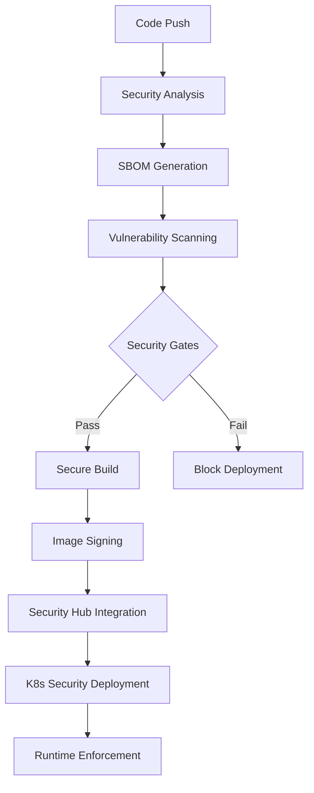

# DevSecOps Pipeline Implementation Guide

## Overview

The DevSecOps pipeline implements **security-first principles with shift-left practices** throughout the entire software development lifecycle. This pipeline integrates comprehensive security scanning, compliance validation, and runtime enforcement while maintaining development velocity.

## Security-First Architecture

### 🔒 Core Security Principles
- **Shift-Left Security**: Security integrated from development start
- **Zero Trust**: Verify everything, trust nothing
- **Defense in Depth**: Multiple security layers
- **Continuous Compliance**: Automated framework alignment

### 🛡️ Security Controls Implementation
- **Supply Chain Security**: SBOM generation and vulnerability scanning
- **Code Security**: SAST, DAST, and secret detection
- **Infrastructure Security**: Policy as code and runtime enforcement
- **Compliance Automation**: SLSA, SSDF, and CIS framework alignment

## Pipeline Architecture



## Implementation Deep Dive

### Job 1: Security Analysis & Secret Scanning

**Purpose**: Comprehensive static analysis and secret detection before any build process.

**Security Tools Integration**:
```yaml
# Multi-tool secret scanning for comprehensive coverage
- name: Run Gitleaks Secret Scan
  uses: gitleaks/gitleaks-action@v2
  
- name: Run Semgrep SAST
  uses: semgrep/semgrep-action@v1
  with:
    config: >-
      p/security-audit
      p/secrets
      p/owasp-top-ten
      p/cwe-top-25

- name: Run Checkov IaC Security Scan
  uses: bridgecrewio/checkov-action@master
  with:
    framework: terraform,dockerfile,kubernetes
    output_format: sarif
```

**Security Rule Configuration**:
```yaml
# Semgrep custom rules for Go applications
rules:
  - id: hardcoded-secret
    pattern: |
      $VAR = "$SECRET"
    message: Hardcoded secret detected
    severity: ERROR
    languages: [go]
    
  - id: sql-injection
    pattern: |
      db.Query($QUERY + $INPUT)
    message: Potential SQL injection vulnerability
    severity: ERROR
    languages: [go]
```

**Quality Gates**:
- Zero secrets detected in code
- No high/critical SAST findings
- Infrastructure security compliance
- License compliance verification

### Job 2: SBOM Generation & Vulnerability Analysis

**Purpose**: Generate comprehensive Software Bill of Materials and perform multi-tool vulnerability scanning.

**SBOM Generation with Syft**:
```bash
# Generate SBOM in multiple formats for compatibility
syft . -o cyclonedx-json=sbom-cyclonedx.json  # Application security focused
syft . -o spdx-json=sbom-spdx.json            # Comprehensive licensing info
syft . -o syft-json=sbom-syft.json            # Syft native format
```

**Multi-Tool Vulnerability Scanning**:
```bash
# Grype - Fast and accurate vulnerability detection
grype sbom:sbom-cyclonedx.json -o json --file grype-results.json

# Snyk - Commercial-grade vulnerability intelligence
snyk test --json-file-output=snyk-results.json

# Trivy - Comprehensive security scanner
trivy fs --format json --output trivy-results.json .
```

**Vulnerability Correlation Logic**:
```go
// Correlate findings across multiple tools
func correlateFindingsAcrossTools(grypeResults, snykResults, trivyResults []Vulnerability) []CorrelatedVulnerability {
    correlationMap := make(map[string]*CorrelatedVulnerability)
    
    // Process Grype findings
    for _, vuln := range grypeResults {
        key := generateCorrelationKey(vuln.Package, vuln.CVE)
        if existing, exists := correlationMap[key]; exists {
            existing.Sources = append(existing.Sources, "grype")
            existing.Confidence++
        } else {
            correlationMap[key] = &CorrelatedVulnerability{
                CVE:        vuln.CVE,
                Package:    vuln.Package,
                Severity:   vuln.Severity,
                Sources:    []string{"grype"},
                Confidence: 1,
            }
        }
    }
    
    // Process other tools similarly...
    return consolidateFindings(correlationMap)
}
```

**Security Gates Implementation**:
```bash
# Severity-based deployment blocking
HIGH_CRITICAL=$(jq '[.matches[] | select(.vulnerability.severity == "High" or .vulnerability.severity == "Critical")] | length' grype-results.json)

if [ "$HIGH_CRITICAL" -gt 0 ]; then
  echo "❌ High/Critical vulnerabilities detected. Blocking deployment."
  exit 1
fi
```

### Job 3: Secure Build & Image Signing

**Purpose**: Build security-hardened container images with cryptographic signing and attestation.

**Security-Hardened Dockerfile**:
```dockerfile
# Multi-stage build with security best practices
FROM golang:1.21-alpine AS builder

# Security: Create non-root user
RUN adduser -D -s /bin/sh appuser

# Security: Install only necessary packages
RUN apk add --no-cache ca-certificates git

WORKDIR /app
COPY go.mod go.sum ./
RUN go mod download && go mod verify

COPY . .
RUN CGO_ENABLED=0 GOOS=linux go build -a -installsuffix cgo -o main .

# Final stage: Distroless image for minimal attack surface
FROM gcr.io/distroless/static:nonroot

# Security: Copy CA certificates
COPY --from=builder /etc/ssl/certs/ca-certificates.crt /etc/ssl/certs/

# Security: Use non-root user
USER nonroot:nonroot

# Copy application binary
COPY --from=builder /app/main /

# Security: Read-only filesystem
VOLUME ["/tmp"]

EXPOSE 8080
ENTRYPOINT ["/main"]
```

**Container Image Signing with Cosign**:
```bash
# Keyless signing using OIDC (GitHub Actions identity)
cosign sign --yes ${{ steps.login-ecr.outputs.registry }}/${{ env.ECR_REPOSITORY }}@${{ steps.build.outputs.digest }}

# Attach SBOM as attestation
cosign attest --yes --predicate sbom-cyclonedx.json --type cyclonedx \
  ${{ steps.login-ecr.outputs.registry }}/${{ env.ECR_REPOSITORY }}@${{ steps.build.outputs.digest }}

# Attach vulnerability scan results
cosign attest --yes --predicate grype-results.json --type vuln \
  ${{ steps.login-ecr.outputs.registry }}/${{ env.ECR_REPOSITORY }}@${{ steps.build.outputs.digest }}
```

**SLSA Provenance Generation**:
```yaml
# Automatic SLSA provenance with Docker Buildx
- name: Build Secure Docker Image
  uses: docker/build-push-action@v5
  with:
    provenance: true  # Generate SLSA provenance
    sbom: true       # Generate SBOM attestation
    labels: |
      org.opencontainers.image.source=${{ github.server_url }}/${{ github.repository }}
      org.opencontainers.image.revision=${{ github.sha }}
      security.sbom.generated=true
      security.vulnerability.scanned=true
```

### Job 4: AWS Security Hub Integration

**Purpose**: Centralize security findings in AWS Security Hub using standardized ASFF format.

**ASFF Conversion Implementation**:
```python
# Convert vulnerability scan results to AWS Security Finding Format
def convert_to_asff(grype_results, image_uri, account_id, region):
    findings = []
    
    for match in grype_results.get('matches', []):
        vuln = match['vulnerability']
        artifact = match['artifact']
        
        # Calculate CVSS score for severity mapping
        severity_mapping = {
            'CRITICAL': 'CRITICAL',
            'HIGH': 'HIGH', 
            'MEDIUM': 'MEDIUM',
            'LOW': 'LOW'
        }
        
        finding = {
            "SchemaVersion": "2018-10-08",
            "Id": f"grype-{vuln['id']}-{artifact['name']}-{uuid.uuid4()}",
            "ProductArn": f"arn:aws:securityhub:{region}::product/anchore/grype",
            "GeneratorId": "devsecops-pipeline",
            "AwsAccountId": account_id,
            "Types": ["Software and Configuration Checks/Vulnerabilities/CVE"],
            "CreatedAt": datetime.utcnow().isoformat() + "Z",
            "UpdatedAt": datetime.utcnow().isoformat() + "Z",
            "Severity": {
                "Label": severity_mapping.get(vuln['severity'], 'INFORMATIONAL'),
                "Normalized": calculate_normalized_severity(vuln.get('cvss', [])),
            },
            "Title": f"Vulnerability {vuln['id']} in {artifact['name']}",
            "Description": vuln.get('description', 'No description available'),
            "Remediation": {
                "Recommendation": {
                    "Text": f"Update {artifact['name']} to a version that fixes {vuln['id']}",
                    "Url": vuln.get('dataSource', '')
                }
            },
            "Resources": [{
                "Type": "AwsEcrContainerImage",
                "Id": image_uri,
                "Region": region,
                "Details": {
                    "AwsEcrContainerImage": {
                        "Name": artifact['name'],
                        "RepositoryName": extract_repo_name(image_uri),
                        "ImageId": {
                            "ImageDigest": extract_digest(image_uri)
                        }
                    }
                }
            }],
            "Compliance": {
                "Status": "FAILED" if vuln['severity'] in ['CRITICAL', 'HIGH'] else "WARNING"
            }
        }
        findings.append(finding)
    
    return findings
```

**Security Hub Batch Import**:
```bash
# Import findings to Security Hub with error handling
import_findings_to_security_hub() {
    local findings_file="$1"
    
    if [ -s "$findings_file" ]; then
        # Split large finding sets into batches (max 100 per batch)
        split -l 100 "$findings_file" findings_batch_
        
        for batch_file in findings_batch_*; do
            aws securityhub batch-import-findings \
                --findings "file://$batch_file" \
                --region "$AWS_REGION" || {
                echo "Failed to import batch: $batch_file"
                return 1
            }
        done
        
        # Cleanup batch files
        rm -f findings_batch_*
        echo "Successfully imported findings to Security Hub"
    else
        echo "No findings to import"
    fi
}
```

### Job 5: Kubernetes Security Enforcement

**Purpose**: Deploy applications with comprehensive runtime security policies using Kyverno.

**Advanced Kyverno Policy Implementation**:
```yaml
# Image signature verification with OIDC
apiVersion: kyverno.io/v1
kind: ClusterPolicy
metadata:
  name: verify-image-signatures
spec:
  validationFailureAction: enforce
  rules:
  - name: verify-signature
    match:
      any:
      - resources:
          kinds: [Pod]
          namespaces: [production, staging]
    verifyImages:
    - imageReferences: ["*"]
      attestors:
      - entries:
        - keyless:
            subject: "https://github.com/{{GITHUB_REPOSITORY}}/.github/workflows/*"
            issuer: "https://token.actions.githubusercontent.com"
            additionalExtensions:
              github_workflow_trigger: "push"
              github_workflow_sha: "{{GITHUB_SHA}}"
      attestations:
      - predicateType: "https://cyclonedx.org/bom"
        attestors:
        - entries:
          - keyless:
              subject: "https://github.com/{{GITHUB_REPOSITORY}}/.github/workflows/*"
              issuer: "https://token.actions.githubusercontent.com"
```

**Runtime Security Context Enforcement**:
```yaml
# Secure deployment with comprehensive security context
apiVersion: apps/v1
kind: Deployment
metadata:
  name: secure-app
  labels:
    security.sbom.generated: "true"
    security.vulnerability.scanned: "true"
    security.image.signed: "true"
spec:
  template:
    spec:
      # Pod-level security context
      securityContext:
        runAsNonRoot: true
        runAsUser: 65534
        runAsGroup: 65534
        fsGroup: 65534
        seccompProfile:
          type: RuntimeDefault
      containers:
      - name: app
        securityContext:
          # Container-level security context
          allowPrivilegeEscalation: false
          readOnlyRootFilesystem: true
          runAsNonRoot: true
          runAsUser: 65534
          capabilities:
            drop: ["ALL"]
            add: ["NET_BIND_SERVICE"]  # Only if needed for port 80/443
        # Resource limits for DoS prevention
        resources:
          limits:
            memory: "512Mi"
            cpu: "500m"
            ephemeral-storage: "1Gi"
          requests:
            memory: "256Mi"
            cpu: "250m"
            ephemeral-storage: "500Mi"
```

**Network Security Policies**:
```yaml
# Default deny-all network policy
apiVersion: networking.k8s.io/v1
kind: NetworkPolicy
metadata:
  name: default-deny-all
spec:
  podSelector: {}
  policyTypes:
  - Ingress
  - Egress

---
# Application-specific network policy
apiVersion: networking.k8s.io/v1
kind: NetworkPolicy
metadata:
  name: app-network-policy
spec:
  podSelector:
    matchLabels:
      app: secure-app
  policyTypes:
  - Ingress
  - Egress
  ingress:
  - from:
    - namespaceSelector:
        matchLabels:
          name: ingress-nginx
    ports:
    - protocol: TCP
      port: 8080
  egress:
  - to:
    - namespaceSelector:
        matchLabels:
          name: database
    ports:
    - protocol: TCP
      port: 5432
  - to: []  # Allow DNS
    ports:
    - protocol: UDP
      port: 53
```

## Security Verification & Compliance

### Continuous Compliance Monitoring

**SLSA Compliance Verification**:
```bash
# Verify SLSA provenance
cosign verify-attestation --type slsaprovenance \
  --certificate-identity-regexp="https://github.com/$GITHUB_REPOSITORY" \
  --certificate-oidc-issuer="https://token.actions.githubusercontent.com" \
  $IMAGE_URI

# Verify SBOM attestation
cosign verify-attestation --type cyclonedx \
  --certificate-identity-regexp="https://github.com/$GITHUB_REPOSITORY" \
  --certificate-oidc-issuer="https://token.actions.githubusercontent.com" \
  $IMAGE_URI
```

**Runtime Policy Compliance**:
```bash
# Check Kyverno policy compliance
kubectl get cpol -o json | jq '.items[] | select(.status.ready == false)'

# Verify pod security compliance
kubectl get pods -o json | jq '.items[] | select(.spec.securityContext.runAsRoot == true)'
```

### Security Metrics Collection

**Vulnerability Trend Analysis**:
```go
// Track vulnerability trends over time
type VulnerabilityMetrics struct {
    Timestamp    time.Time `json:"timestamp"`
    Repository   string    `json:"repository"`
    CommitSHA    string    `json:"commit_sha"`
    Critical     int       `json:"critical_count"`
    High         int       `json:"high_count"`
    Medium       int       `json:"medium_count"`
    Low          int       `json:"low_count"`
    TotalSBOMComponents int `json:"total_sbom_components"`
    ScanDuration        int `json:"scan_duration_seconds"`
}

func collectSecurityMetrics(scanResults *SecurityScanResult) {
    metrics := VulnerabilityMetrics{
        Timestamp:           time.Now(),
        Repository:          scanResults.Repository,
        CommitSHA:          scanResults.CommitSHA,
        Critical:           scanResults.VulnerabilityResults.Summary.Critical,
        High:              scanResults.VulnerabilityResults.Summary.High,
        Medium:            scanResults.VulnerabilityResults.Summary.Medium,
        Low:               scanResults.VulnerabilityResults.Summary.Low,
        TotalSBOMComponents: countSBOMComponents(scanResults.SBOMFile),
        ScanDuration:       int(scanResults.ScanDuration.Seconds()),
    }
    
    // Send to CloudWatch or other monitoring system
    publishMetricsToCloudWatch(metrics)
}
```

## Configuration & Setup

### Required Repository Secrets
```bash
# Security tool tokens (optional but recommended)
SNYK_TOKEN=snyk_token_here
SEMGREP_APP_TOKEN=semgrep_token_here

# AWS configuration
AWS_ACCOUNT_ID=123456789012
AWS_REGION=us-east-1
ECR_REPOSITORY=secure-app
SECURITY_ARTIFACTS_BUCKET=security-artifacts-bucket
```

### Kyverno Installation
```bash
# Install Kyverno using Helm
helm repo add kyverno https://kyverno.github.io/kyverno/
helm repo update
helm install kyverno kyverno/kyverno -n kyverno-system --create-namespace

# Apply security policies
kubectl apply -f devsecops/security-policies/kyverno-policies.yaml
```

### Security Hub Setup
```bash
# Enable Security Hub
aws securityhub enable-security-hub --enable-default-standards

# Subscribe to security standards
aws securityhub batch-enable-standards \
  --standards-subscription-requests StandardsArn=arn:aws:securityhub:::ruleset/finding-format/aws-foundational-security-standard/v/1.0.0,StandardsArn=arn:aws:securityhub:us-east-1::standard/cis-aws-foundations-benchmark/v/1.2.0
```

## Performance & Optimization

### Security Scan Performance
- **SBOM Generation**: ~30-60 seconds
- **Vulnerability Scanning**: ~2-5 minutes (depending on dependencies)
- **Image Signing**: ~10-30 seconds
- **Policy Validation**: ~5-15 seconds

### Optimization Strategies
1. **Parallel Scanning**: Run multiple security tools concurrently
2. **Incremental Scanning**: Only scan changed components
3. **Caching**: Cache vulnerability databases and scan results
4. **Tool Selection**: Use fastest tools for CI/CD, comprehensive tools for scheduled scans

## Troubleshooting

### Common Security Issues

**Image Signature Verification Failures**:
```bash
# Debug signature verification
cosign verify --certificate-identity-regexp="https://github.com/.*" \
  --certificate-oidc-issuer="https://token.actions.githubusercontent.com" \
  $IMAGE_URI

# Check Kyverno policy logs
kubectl logs -n kyverno-system -l app.kubernetes.io/name=kyverno
```

**Vulnerability Scan Failures**:
```bash
# Check vulnerability database updates
grype db status
grype db update

# Verify SBOM format
syft . -o cyclonedx-json | jq '.components | length'
```

**Security Hub Import Issues**:
```bash
# Validate ASFF format
aws securityhub batch-import-findings --findings file://test-finding.json --dry-run

# Check Security Hub service status
aws securityhub describe-hub
```

## Integration Benefits

### Security Advantages
- **Early Vulnerability Detection**: Shift-left security practices
- **Supply Chain Protection**: Comprehensive SBOM and signing
- **Runtime Security**: Policy-based enforcement
- **Compliance Automation**: Framework-aligned evidence collection

### Business Value
- **Risk Reduction**: Proactive security threat mitigation
- **Audit Readiness**: Automated compliance evidence
- **Developer Productivity**: Security integrated into workflow
- **Cost Optimization**: Early issue detection reduces remediation costs

This DevSecOps pipeline provides enterprise-grade security while maintaining development velocity, ensuring your applications meet the highest security standards from development through production.