```mermaid
graph TB
    A[Master Orchestrator] --> B[Security Orchestration]
    A --> C[Infrastructure Orchestration]
    A --> D[Application Orchestration]
    A --> E[Testing Orchestration]
    A --> F[Monitoring Orchestration]
    A --> G[Cost Optimization]
    A --> H[Compliance Orchestration]
    
    B --> B1[SAST/DAST/SCA]
    B --> B2[SBOM Generation]
    B --> B3[Compliance Validation]
    
    C --> C1[Terraform/Terragrunt]
    C --> C2[Cost Analysis]
    C --> C3[Drift Detection]
    
    D --> D1[Rolling Deployment]
    D --> D2[Blue-Green Deployment]
    D --> D3[Canary Deployment]
    
    E --> E1[Unit/Integration Tests]
    E --> E2[E2E/Performance Tests]
    E --> E3[Security/Chaos Tests]
    
    F --> F1[Infrastructure Monitoring]
    F --> F2[Application Monitoring]
    F --> F3[Security Monitoring]
    
    G --> G1[Cost Analysis]
    G --> G2[Resource Optimization]
    G --> G3[Budget Enforcement]
    
    H --> H1[SLSA/SSDF]
    H --> H2[SOX/PCI/GDPR]
    H --> H3[Audit Trails]
```

# 🚀 Enterprise DevSecOps Orchestration Guide

## 🎯 Overview

This guide provides comprehensive documentation for the enterprise-grade DevSecOps orchestration system that demonstrates world-class architecture patterns, security-first design, and cost-conscious engineering.

## 🏗️ Architecture Overview



## 🎮 Getting Started

### Prerequisites

```bash
# Required tools and versions
aws-cli >= 2.0.0
terraform >= 1.6.0
terragrunt >= 0.53.0
kubectl >= 1.28.0
docker >= 24.0.0
```

### Environment Setup

1. **Configure AWS OIDC**:
```bash
# Create OIDC provider and role
aws iam create-open-id-connect-provider \
  --url https://token.actions.githubusercontent.com \
  --client-id-list sts.amazonaws.com
```

2. **Set Repository Secrets**:
```yaml
AWS_ROLE_ARN: arn:aws:iam::123456789012:role/GitHubActionsRole
SNYK_TOKEN: your-snyk-token
SONAR_TOKEN: your-sonar-token
```

3. **Initialize Infrastructure**:
```bash
cd terragrunt/environments/dev
terragrunt init
terragrunt plan
terragrunt apply
```

## 🎯 Orchestration Control Plane

### Master Orchestrator

The master orchestrator (`enterprise-orchestrator.yml`) serves as the control plane that:

- **Environment Detection**: Automatically determines target environment
- **Strategy Selection**: Chooses appropriate deployment strategy
- **Security Gates**: Enforces security requirements
- **Cost Controls**: Applies cost thresholds
- **Compliance Requirements**: Determines compliance frameworks

### Workflow Triggers

| Trigger | Environment | Strategy | Security | Compliance |
|---------|-------------|----------|----------|------------|
| `main` branch | production | blue-green | required | full |
| `develop` branch | staging | canary | required | basic |
| Feature branches | dev | rolling | required | basic |
| Manual dispatch | configurable | configurable | optional | configurable |
| Scheduled | all | rolling | required | environment-based |

## 🛡️ Security Orchestration

### Comprehensive Security Pipeline

```yaml
# Security scanning matrix
strategy:
  matrix:
    scan_type: [sast, sca, secrets, container]
```

#### SAST (Static Application Security Testing)
- **Tool**: GitHub CodeQL
- **Languages**: Python, JavaScript, Go, Java
- **Thresholds**: Medium+ severity for blocking

#### SCA (Software Composition Analysis)
- **Tool**: Snyk
- **Scope**: All project dependencies
- **Thresholds**: High+ severity for blocking

#### Secrets Scanning
- **Tool**: TruffleHog
- **Scope**: Full repository history
- **Action**: Block on any secrets found

#### Container Scanning
- **Tool**: Trivy
- **Scope**: All container images
- **Thresholds**: Critical vulnerabilities block deployment

### SBOM Generation

```bash
# Generate comprehensive SBOMs
syft packages dir:./app -o cyclonedx-json=sbom.json
syft packages dir:./terraform -o cyclonedx-json=infrastructure-sbom.json
grype sbom:sbom.json -o sarif > vulnerabilities.sarif
```

### Compliance Validation

- **SLSA Level 3**: Provenance generation and validation
- **SSDF**: Secure Software Development Framework compliance
- **Policy Validation**: OPA policy enforcement

## 🏗️ Infrastructure Orchestration

### Terraform/Terragrunt Integration

```yaml
# Infrastructure deployment flow
1. Plan Generation → 2. Cost Estimation → 3. Threshold Check → 4. Deployment → 5. Validation
```

#### Cost Controls
- **Development**: $100 threshold
- **Staging**: $500 threshold  
- **Production**: $1000 threshold

#### Drift Detection
- Automated configuration drift detection
- Remediation recommendations
- Alert generation for manual review

### Multi-Environment Management

```bash
terragrunt/
├── environments/
│   ├── dev/
│   ├── staging/
│   └── production/
└── terragrunt.hcl  # Global configuration
```

## 🚀 Deployment Strategies

### Rolling Deployment
- **Use Case**: Development environments
- **Characteristics**: Fast, minimal downtime
- **Risk**: Medium (gradual rollout)

### Blue-Green Deployment
- **Use Case**: Production environments
- **Characteristics**: Zero downtime, instant rollback
- **Risk**: Low (full environment switch)

### Canary Deployment
- **Use Case**: Staging validation
- **Characteristics**: Gradual traffic shift (10% → 100%)
- **Risk**: Low (monitored rollout)

### Deployment Validation

```yaml
# Post-deployment checks
- Health checks (HTTP 200 responses)
- Performance validation (response time < 200ms)
- Error rate monitoring (< 0.1%)
- Automatic rollback on failure
```

## 🧪 Testing Orchestration

### Testing Pyramid

```mermaid
pyramid TB
    A[Unit Tests] --> B[Integration Tests]
    B --> C[Contract Tests]
    C --> D[E2E Tests]
    D --> E[Performance Tests]
    E --> F[Security Tests]
    F --> G[Chaos Engineering]
```

#### Test Execution Matrix

| Test Type | Tools | Environments | Parallel |
|-----------|-------|--------------|----------|
| Unit | pytest, go test | all | ✅ |
| Integration | go test, pytest | all | ✅ |
| Contract | Pact | staging, prod | ❌ |
| E2E | Playwright | all | ✅ |
| Performance | k6 | staging, prod | ❌ |
| Security | OWASP ZAP | all | ❌ |
| Chaos | Litmus | dev, staging | ❌ |

### Performance Testing

```javascript
// k6 performance test example
import http from 'k6/http';
import { check } from 'k6';

export let options = {
  stages: [
    { duration: '2m', target: 100 },
    { duration: '5m', target: 100 },
    { duration: '2m', target: 0 },
  ],
};

export default function() {
  let response = http.get(`${__ENV.BASE_URL}/api/health`);
  check(response, {
    'status is 200': (r) => r.status === 200,
    'response time < 200ms': (r) => r.timings.duration < 200,
  });
}
```

## 📊 Monitoring Orchestration

### Multi-Dimensional Monitoring

#### Infrastructure Monitoring
- **CloudWatch Dashboards**: CPU, Memory, Network, Disk
- **Alarms**: Threshold-based alerting
- **Auto-scaling**: Predictive scaling policies

#### Application Monitoring
- **Grafana Dashboards**: Business and technical metrics
- **Prometheus**: Custom metrics collection
- **Service Monitors**: Kubernetes service discovery

#### Security Monitoring
- **Security Hub**: Centralized findings
- **GuardDuty**: Threat detection
- **Config Rules**: Compliance monitoring

#### Cost Monitoring
- **Budgets**: Monthly cost limits
- **Anomaly Detection**: Unusual spending patterns
- **Rightsizing**: Resource optimization recommendations

### SLA/SLO Monitoring

| Environment | Availability | Latency | Error Rate |
|-------------|--------------|---------|------------|
| Production | 99.9% | <200ms | <0.1% |
| Staging | 99.5% | <500ms | <1.0% |
| Development | 99.0% | <1000ms | <5.0% |

## 💰 Cost Optimization

### Automated Cost Management

```yaml
# Cost optimization areas
- Resource rightsizing (EC2, RDS)
- Reserved instance recommendations
- Spot instance utilization
- Storage optimization (EBS, S3)
- Auto-scaling efficiency
- Unused resource cleanup
```

### Cost Governance

#### Budget Controls
- Environment-specific budgets
- Automated alerts at 80% threshold
- Approval workflows for overages

#### Resource Tagging
```yaml
# Mandatory tags
Environment: dev|staging|production
Project: sbom-security-pipeline
Owner: team-name
CostCenter: engineering
```

### Optimization Strategies

1. **Right-sizing**: Continuous analysis of resource utilization
2. **Reserved Instances**: 1-year commitments for stable workloads
3. **Spot Instances**: Cost-effective compute for fault-tolerant workloads
4. **Storage Tiering**: Automated lifecycle policies for S3
5. **Auto-scaling**: Demand-based resource allocation

## 📋 Compliance Orchestration

### Framework Coverage

#### SLSA (Supply-chain Levels for Software Artifacts)
- **Level 1**: ✅ Build process documentation
- **Level 2**: ✅ Tamper-resistant build service
- **Level 3**: ✅ Non-falsifiable provenance
- **Level 4**: 🔄 Hermetic builds (roadmap)

#### SSDF (Secure Software Development Framework)
- **Prepare Organization**: Security training, standards
- **Protect Software**: Threat modeling, secure coding
- **Produce Secured Software**: Security testing, code review
- **Respond to Vulnerabilities**: Monitoring, remediation

#### Enterprise Compliance (Production Only)
- **SOX**: IT general controls, change management
- **PCI DSS**: Payment card data protection
- **GDPR**: Data privacy and protection
- **HIPAA**: Healthcare data protection

### Audit Trail Generation

```json
{
  "audit_id": "audit-20240115-143022",
  "timestamp": "2024-01-15T14:30:22Z",
  "environment": "production",
  "compliance_frameworks": "SLSA,SSDF,SOX,PCI,GDPR",
  "compliance_score": 95,
  "controls_validated": {
    "slsa": "success",
    "ssdf": "success",
    "sox": "success"
  },
  "attestations": ["slsa-provenance.json"],
  "retention_years": 7
}
```

## 🚨 Disaster Recovery

### DR Orchestration Capabilities

#### Disaster Types Supported
- **Region Failure**: Multi-region failover
- **Data Corruption**: Point-in-time recovery
- **Security Breach**: Isolated environment recovery
- **Full Recovery Test**: End-to-end DR validation

#### Recovery Targets

| Environment | RTO | RPO | Strategy |
|-------------|-----|-----|----------|
| Production | 4 hours | 1 hour | Active-Passive |
| Staging | 8 hours | 4 hours | Backup-Restore |

#### Recovery Components
1. **Infrastructure**: Terraform deployment to DR region
2. **Data**: RDS point-in-time recovery, EFS restore
3. **Application**: Kubernetes deployment to DR cluster
4. **Validation**: Health checks, functional tests
5. **Metrics**: RTO/RPO measurement and reporting

## 🎓 Best Practices

### Workflow Design
1. **Idempotency**: All workflows safely re-runnable
2. **Error Handling**: Graceful failure with clear messages
3. **Observability**: Comprehensive logging and metrics
4. **Security**: Least privilege, secret management
5. **Efficiency**: Parallel execution where possible

### Security Practices
1. **Shift-Left**: Security validation early in pipeline
2. **Defense in Depth**: Multiple security layers
3. **Zero Trust**: Verify everything, trust nothing
4. **Continuous Monitoring**: Real-time threat detection
5. **Incident Response**: Automated response workflows

### Cost Management
1. **Right-sizing**: Continuous resource optimization
2. **Reserved Capacity**: Long-term commitments for savings
3. **Automation**: Automated scaling and cleanup
4. **Monitoring**: Real-time cost tracking
5. **Governance**: Budget controls and approvals

### Compliance Management
1. **Automation**: Automated compliance validation
2. **Documentation**: Comprehensive audit trails
3. **Attestation**: Cryptographic proof of controls
4. **Retention**: Long-term evidence storage
5. **Reporting**: Regular compliance dashboards

## 🚀 Advanced Features

### GitOps Integration
- Infrastructure as Code with Terraform/Terragrunt
- Application configuration with Kubernetes manifests
- Policy as Code with OPA/Gatekeeper
- Automated drift detection and remediation

### Multi-Cloud Capabilities
- Cloud-agnostic infrastructure patterns
- Cross-cloud backup and disaster recovery
- Hybrid cloud deployment strategies
- Cost optimization across providers

### AI/ML Integration
- Predictive auto-scaling
- Anomaly detection for security and cost
- Intelligent alerting and noise reduction
- Performance optimization recommendations

## 📈 Metrics and KPIs

### DevSecOps Metrics
- **Deployment Frequency**: Daily deployments
- **Lead Time**: Code to production < 4 hours
- **MTTR**: Mean time to recovery < 1 hour
- **Change Failure Rate**: < 5%

### Security Metrics
- **Vulnerability Remediation Time**: < 24 hours for critical
- **Security Test Coverage**: > 95%
- **Compliance Score**: > 90%
- **Security Incidents**: Zero tolerance for preventable incidents

### Cost Metrics
- **Cost per Deployment**: Trending down
- **Resource Utilization**: > 80% for production
- **Waste Reduction**: 25% cost optimization annually
- **Budget Variance**: < 10% monthly variance

## 🎯 Success Criteria

### Technical Excellence
- Zero-downtime deployments
- Sub-second application response times
- 99.9% availability SLA
- Automated recovery from failures

### Security Posture
- Zero critical vulnerabilities in production
- 100% security scan coverage
- Automated compliance validation
- Comprehensive audit trails

### Operational Efficiency
- Fully automated deployment pipeline
- Self-healing infrastructure
- Predictive monitoring and alerting
- Cost-optimized resource utilization

### Business Value
- Faster time to market
- Reduced operational overhead
- Improved security posture
- Lower total cost of ownership

---

## 🏆 Conclusion

This enterprise DevSecOps orchestration system demonstrates world-class architecture that balances security, compliance, cost efficiency, and operational excellence. It provides a comprehensive foundation for scaling DevSecOps practices across large organizations while maintaining the highest standards of quality and reliability.

The system showcases senior-level expertise across multiple domains and serves as a reference implementation for enterprise-grade DevSecOps transformation initiatives.